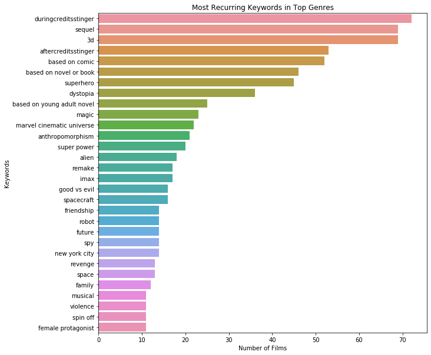

# Final Project Submission

## Please fill out:
* Student name:
    - Carl Cook
* Student pace: 
    - Part-Time
* Scheduled project review date/time: 
    - June 10, 2020 4:30 pm
* Instructor name: 
    - James Irving
* Blog post URL:
    - NONE

# Questions

## What genres perform the best?

### TMDB API

Here we use the TMDB API to gather our own information to work with. This is probably our best information source.


```python
import json
import pandas as pd
import requests
import matplotlib.pyplot as plt
```

#### Function to supply API key


```python
def get_key(path):
    with open(path) as f:
        return json.load(f)
```


```python
key = get_key("/Users/katma/.secret/tmdb_api.json")
api_key = key["api_key"]
```

#### Building DataFrame


```python
columns = ['id', 'title', 'revenue', 'budget', 'writer', 'director', 'genres', 'year', 'date', 'keywords']
df = pd.DataFrame(columns=columns)
years = ['2010', '2011', '2012', '2013', '2014', '2015', '2016', '2017', '2018', '2019']
```

#### Filling DataFrame

This code takes a long time to run, and the resulting dataframe has been pickled below to save you the trouble.


```python
# Loops from 2010 to 2019
count = 1
for x in years:
    print('**'+x+'**')
    page = 1
    # Grabs first 10 pages from API
    while page <= 10:
        url = 'https://api.themoviedb.org/3/discover/movie?api_key=' + api_key + \
            '&language=en-US&sort_by=revenue.desc&include_adult=false&include_video=false&page=' + \
            str(page) + '&primary_release_year=' + str(x)
        by_year = requests.get(url)
        year = by_year.json()
        results = year['results']
        page += 1
        # Pulls information for each film on the current page
        for film in results:
            print(str(count)+': '+film['title'])
            count += 1
            try:
                film_rev = requests.get('https://api.themoviedb.org/3/movie/' + str(film['id']) +\
                                        '?api_key=' + api_key).json()
                crew = requests.get('https://api.themoviedb.org/3/movie/' + str(film['id']) +\
                                    '/credits?api_key=' + api_key).json()
                keywords = requests.get('https://api.themoviedb.org/3/movie/' +str(film['id']) +\
                                        '/keywords?api_key=' + api_key).json()
                details = [str(film['id']), film['title'], film_rev['revenue'], film_rev['budget'],\
                           [x['name'] for x in crew['crew'] if x['job']=='Screenplay' or (x['job']=='Writer')],\
                           [x['name'] for x in crew['crew'] if (x['job']=='Director')],\
                           [x['name'] for x in film_rev['genres']], film_rev['release_date'][:4],\
                           film_rev['release_date'][5:], [x['name'] for x in keywords['keywords']]]
                df.loc[len(df)]=details
            except:
                continue
```

    **2010**
    1: Toy Story 3
    2: Alice in Wonderland
    3: Harry Potter and the Deathly Hallows: Part 1
    4: Inception
    5: Shrek Forever After
    6: The Twilight Saga: Eclipse
    7: Iron Man 2
    8: Tangled
    9: Despicable Me
    10: How to Train Your Dragon
    11: The Chronicles of Narnia: The Voyage of the Dawn Treader
    12: The King's Speech
    13: TRON: Legacy
    14: The Karate Kid
    15: Tom and Jerry Meet Sherlock Holmes
    16: Prince of Persia: The Sands of Time
    17: Black Swan
    18: Megamind
    19: The Last Airbender
    20: Robin Hood
    21: Little Fockers
    22: Resident Evil: Afterlife
    23: Shutter Island
    24: Salt
    25: Sex and the City 2
    26: The Tourist
    27: The Expendables
    28: Grown Ups
    29: Knight and Day
    30: True Grit
    31: Gulliver's Travels
    32: Clash of the Titans
    33: Percy Jackson & the Olympians: The Lightning Thief
    34: The Social Network
    35: Valentine's Day
    36: The Sorcerer's Apprentice
    37: Due Date
    38: Eat Pray Love
    39: Yogi Bear
    40: Paranormal Activity 2
    41: The A-Team
    42: The Other Guys
    43: Unstoppable
    44: Step Up 3D
    45: The Book of Eli
    46: The Town
    47: Date Night
    48: The Secret World of Arrietty
    49: Legend of the Guardians: The Owls of Ga'Hoole
    50: Saw 3D
    51: The Bounty Hunter
    52: Wall Street: Money Never Sleeps
    53: Predators
    54: Nanny McPhee and the Big Bang
    55: Jackass 3D
    56: A Nightmare on Elm Street
    57: Dear John
    58: Cats & Dogs: The Revenge of Kitty Galore
    59: Tooth Fairy
    60: Life As We Know It
    61: Hereafter
    62: Love & Other Drugs
    63: The Other Woman
    64: Aftershock
    65: Killers
    66: Insidious
    67: Kick-Ass
    68: Green Zone
    69: The Fighter
    70: Get Him to the Greek
    71: Burlesque
    72: Dinner for Schmucks
    73: Marmaduke
    74: Doraemon: Nobita's Great Battle of the Mermaid King
    75: Piranha 3D
    76: Letters to Juliet
    77: Vampires Suck
    78: The Back-Up Plan
    79: Easy A
    80: Edge of Darkness
    81: Bayside Shakedown 3: Set the Guys Loose
    82: RED
    83: A Turtle's Tale: Sammy's Adventures
    84: Takers
    85: Legion
    86: The Last Exorcism
    87: Skyline
    88: Welcome to the South
    89: The American
    90: Hot Tub Time Machine
    91: Elite Squad: The Enemy Within
    92: Enthiran
    93: Secretariat
    94: The Ghost Writer
    95: Why Did I Get Married Too?
    96: Morning Glory
    97: Remember Me
    98: Cop Out
    99: The Crazies
    100: From Paris with Love
    101: Detective Dee and the Mystery of the Phantom Flame
    102: The Next Three Days
    103: Alpha and Omega
    104: The Switch
    105: She's Out of My League
    106: How Do You Know
    107: Little White Lies
    108: Charlie St. Cloud
    109: Scott Pilgrim vs. the World
    110: Heartbreaker
    111: The Debt
    112: The Spy Next Door
    113: Machete
    114: The Man from Nowhere
    115: When in Rome
    116: My Name Is Khan
    117: Going the Distance
    118: Of Gods and Men
    119: For Colored Girls
    120: Don't Be Afraid of the Dark
    121: Furry Vengeance
    122: Ip Man 2
    123: 127 Hours
    124: The Kids Are All Right
    125: The Extraordinary Adventures of Adèle Blanc-Sec
    126: Devil
    127: You Again
    128: Leap Year
    129: Ramona and Beezus
    130: The Round Up
    131: Biutiful
    132: Fair Game
    133: Let Me In
    134: The Losers
    135: Faster
    136: Recep Ivedik 3
    137: Our Russia. Eggs of Destiny
    138: Just Wright
    139: Our Family Wedding
    140: 71: Into the Fire
    141: Country Strong
    142: The Way Back
    143: Ayirathil Oruvan
    144: My Soul to Take
    145: Buried
    146: Three Heroes and the Shamakhan Queen
    147: Repo Men
    148: StreetDance 3D
    149: Another Year
    150: Norwegian Wood
    151: 13 Assassins
    152: Sarah's Key
    153: The Last Godfather
    154: Blue Valentine
    155: Tomorrow, When the War Began
    156: Barbie in A Mermaid Tale
    157: The Nutcracker
    158: The Conspirator
    159: Kandahar
    160: Extraordinary Measures
    161: Winter's Bone
    162: The Way
    163: In a Better World
    164: Julia's Eyes
    165: Made in Dagenham
    166: Cho Kamen Rider Den-O Trilogy - Episode Red: ZeronoStar Twinkle
    167: What Men Talk About
    168: Cho Kamen Rider Den-O Trilogy - Episode Blue: The Dispatched Imagin is Newtral
    169: I Hate Luv Storys
    170: Vinnaithaandi Varuvaayaa
    171: Cho Kamen Rider Den-O Trilogy - Episode Yellow: Treasure de End Pirates
    172: Tamara Drewe
    173: Space Battleship Yamato
    174: The Warrior's Way
    175: Halo: Legends
    176: Jonah Hex
    177: Love and the City 2
    178: Thillalangadi
    179: Eesan
    180: Milaga
    181: Chikku Bhukku
    182: Khatta Meetha
    183: Never Let Me Go
    184: Ghost
    185: Singam
    186: Raavanan
    187: Stone
    188: MacGruber
    189: Boy
    190: Vedam
    191: Fatal
    192: We Are from the Future 2
    193: New Kids Turbo
    194: Barney's Version
    195: Outrage
    196: Once Upon a Time in Mumbaai
    197: Loose Cannons
    198: Senna
    199: Inside Job
    200: Last Night
    **2011**
    201: Harry Potter and the Deathly Hallows: Part 2
    202: Transformers: Dark of the Moon
    203: Pirates of the Caribbean: On Stranger Tides
    204: The Twilight Saga: Breaking Dawn - Part 1
    205: Mission: Impossible - Ghost Protocol
    206: Kung Fu Panda 2
    207: Fast Five
    208: The Smurfs
    209: Cars 2
    210: Puss in Boots
    211: Rio
    212: Rise of the Planet of the Apes
    213: Thor
    214: The Intouchables
    215: The Adventures of Tintin
    216: Captain America: The First Avenger
    217: X-Men: First Class
    218: Alvin and the Chipmunks: Chipwrecked
    219: Sherlock Holmes: A Game of Shadows
    220: Real Steel
    221: Bridesmaids
    222: Super 8
    223: The Hangover Part II
    224: Rango
    225: The Girl with the Dragon Tattoo
    226: The Green Hornet
    227: Immortals
    228: Green Lantern
    229: The Help
    230: Bad Teacher
    231: Just Go with It
    232: Horrible Bosses
    233: Paranormal Activity 3
    234: Battle: Los Angeles
    235: Gnomeo & Juliet
    236: Mr. Popper's Penguins
    237: Hugo
    238: Hop
    239: War Horse
    240: The Descendants
    241: Cowboys & Aliens
    242: In Time
    243: Zookeeper
    244: The Muppets
    245: Limitless
    246: Johnny English Reborn
    247: Zindagi Na Milegi Dobara
    248: Final Destination 5
    249: Tower Heist
    250: Midnight in Paris
    251: Friends with Benefits
    252: Happy Feet Two
    253: I Am Number Four
    254: Jack and Jill
    255: No Strings Attached
    256: Source Code
    257: Crazy, Stupid, Love.
    258: New Year's Eve
    259: Contagion
    260: The Best Exotic Marigold Hotel
    261: The Artist
    262: Ghost Rider: Spirit of Vengeance
    263: The Three Musketeers
    264: Unknown
    265: The Adjustment Bureau
    266: We Bought a Zoo
    267: Water for Elephants
    268: The Iron Lady
    269: Moneyball
    270: Sanctum
    271: 7Aum Arivu
    272: Justin Bieber: Never Say Never
    273: Paul
    274: Scream 4
    275: The Rite
    276: Dolphin Tale
    277: The Flowers of War
    278: Season of the Witch
    279: Sucker Punch
    280: Red Riding Hood
    281: The Inbetweeners Movie
    282: Hall Pass
    283: Spy Kids: All the Time in the World
    284: The Lincoln Lawyer
    285: J. Edgar
    286: Big Mommas: Like Father, Like Son
    287: Abduction
    288: Tinker Tailor Soldier Spy
    289: Priest
    290: Drive
    291: The Grey
    292: The Ides of March
    293: The Change-Up
    294: The Dilemma
    295: Something Borrowed
    296: The Darkest Hour
    297: Hanna
    298: Footloose
    299: From Up on Poppy Hill
    300: Colombiana
    301: One Day
    302: Killer Elite
    303: Extremely Loud & Incredibly Close
    304: The Tree of Life
    305: Madea's Big Happy Family
    306: The Roommate
    307: The Mechanic
    308: War of the Arrows
    309: Conan the Barbarian
    310: Sunny
    311: Soul Surfer
    312: Arthur
    313: Beastly
    314: Kokowääh
    315: Fright Night
    316: 30 Minutes or Less
    317: Monte Carlo
    318: 50/50
    319: Oosaravelli
    320: Mars Needs Moms
    321: Dream House
    322: Jumping the Broom
    323: Larry Crowne
    324: A Very Harold & Kumar Christmas
    325: My Week with Marilyn
    326: The Sitter
    327: Jane Eyre
    328: Courageous
    329: Punch
    330: Shaolin
    331: Haywire
    332: Detective K: Secret of Virtuous Widow
    333: Silenced
    334: I Don't Know How She Does It
    335: What's Your Number?
    336: A Few Best Men
    337: Warriors of the Rainbow: Seediq Bale - Part 2: The Rainbow Bridge
    338: Drive Angry
    339: The Thing
    340: Mankatha
    341: Carnage
    342: A Dangerous Method
    343: The Eagle
    344: Ready
    345: Your Highness
    346: Apollo 18
    347: A Lonely Place to Die
    348: Singham
    349: Our Idiot Brother
    350: A Separation
    351: From Iran, a Separation
    352: The Rum Diary
    353: The Lost Bladesman
    354: Warrior
    355: Young Adult
    356: Polisse
    357: Kaavalan
    358: Rockstar
    359: The Guard
    360: Margin Call
    361: Shame
    362: Glee: The Concert Movie
    363: Mere Brother Ki Dulhan
    364: Delhi Belly
    365: Gooische Vrouwen
    366: What Men Still Talk About
    367: The Dirty Picture
    368: Melancholia
    369: Headhunters
    370: Anonymous
    371: African Cats
    372: Pina
    373: Winnie the Pooh
    374: You're Next
    375: Beginners
    376: Judy Moody and the Not Bummer Summer
    377: The Story Of Short Stack
    378: X-Large
    379: Shadow Boxing 3. The Final Round
    380: Hoodwinked Too! Hood VS. Evil
    381: Leafie, a Hen Into the Wild
    382: Silent House
    383: The Worst Week of My Life
    384: Seeking Justice
    385: This Must Be the Place
    386: We Need to Talk About Kevin
    387: Win Win
    388: Straw Dogs
    389: Prom
    390: Shark Night 3D
    391: The Best Movie 3-DE
    392: Delicacy
    393: Trespass
    394: Hysteria
    395: Guo Ming Yi
    396: Dum Maaro Dum
    397: Beremennyy
    398: Hollywood & Wine
    399: Aarakshan
    400: Born to Be Wild
    **2012**
    401: The Avengers
    402: Skyfall
    403: The Dark Knight Rises
    404: The Hobbit: An Unexpected Journey
    405: The Hobbit: An Unexpected Journey (Extended Edition)
    406: Ice Age: Continental Drift
    407: The Twilight Saga: Breaking Dawn - Part 2
    408: The Amazing Spider-Man
    409: Madagascar 3: Europe's Most Wanted
    410: The Hunger Games
    411: Men in Black 3
    412: Life of Pi
    413: Ted
    414: Brave
    415: Wreck-It Ralph
    416: Les Misérables
    417: Django Unchained
    418: Prometheus
    419: Snow White and the Huntsman
    420: Taken 2
    421: Hotel Transylvania
    422: Journey 2: The Mysterious Island
    423: The Lorax
    424: The Expendables 2
    425: Rise of the Guardians
    426: Battleship
    427: Wrath of the Titans
    428: John Carter
    429: The Bourne Legacy
    430: Lincoln
    431: Dark Shadows
    432: Resident Evil: Retribution
    433: Silver Linings Playbook
    434: American Reunion
    435: Argo
    436: Jack Reacher
    437: Safe House
    438: Lost in Thailand
    439: 21 Jump Street
    440: Total Recall
    441: The Impossible
    442: The Vow
    443: Mirror Mirror
    444: The Dictator
    445: Magic Mike
    446: Flight
    447: Underworld: Awakening
    448: This Means War
    449: Chronicle
    450: Paranormal Activity 4
    451: Step Up Revolution
    452: Zero Dark Thirty
    453: Cloud Atlas
    454: The Woman in Black
    455: Parental Guidance
    456: The Pirates! In an Adventure with Scientists!
    457: Abraham Lincoln: Vampire Hunter
    458: Pitch Perfect
    459: Hope Springs
    460: ParaNorman
    461: The Campaign
    462: Painted Skin: The Resurrection
    463: The Devil Inside
    464: Someone Wants to Talk with You
    465: Project X
    466: The Lucky One
    467: Think Like a Man
    468: This Is 40
    469: The Possession
    470: The Thieves
    471: Savages
    472: Sinister
    473: Act of Valor
    474: What to Expect When You're Expecting
    475: To Rome with Love
    476: Here Comes the Boom
    477: The Cabin in the Woods
    478: Anna Karenina
    479: The Watch
    480: Moonrise Kingdom
    481: Madea's Witness Protection
    482: Contraband
    483: Rurouni Kenshin Part I: Origins
    484: Evangelion: 3.0 You Can (Not) Redo
    485: Quartet
    486: Rock of Ages
    487: That's My Boy
    488: The Odd Life of Timothy Green
    489: The Three Stooges
    490: The Five-Year Engagement
    491: Lawless
    492: Silent Hill: Revelation 3D
    493: Ek Tha Tiger
    494: Red Tails
    495: HOUBA! On the Trail of the Marsupilami
    496: End of Watch
    497: Looper
    498: Man on a Ledge
    499: Red Dawn
    500: House at the End of the Street
    501: Pokémon the Movie: Kyurem vs. the Sword of Justice
    502: The Guilt Trip
    503: Dredd
    504: Would I Lie to You? 3
    505: Safe
    506: Killing Them Softly
    507: One for the Money
    508: The Place Beyond the Pines
    509: Arbitrage
    510: Always - Sunset on Third Street 3
    511: Frankenweenie
    512: Welcome to the North
    513: Chimpanzee
    514: Salmon Fishing in the Yemen
    515: Cirque du Soleil: Worlds Away
    516: 2016: Obama's America
    517: The Perks of Being a Wallflower
    518: Seven Psychopaths
    519: Katy Perry: Part of Me
    520: Bait
    521: Lockout
    522: Premium Rush
    523: Rowdy Rathore
    524: Alex Cross
    525: Amour
    526: The Raven
    527: My Way
    528: The Master
    529: Thuppakki
    530: Agneepath
    531: Rust and Bone
    532: On the Other Side of the Tracks
    533: Big Miracle
    534: Sparkle
    535: Wanderlust
    536: Hitchcock
    537: Tad, the Lost Explorer
    538: A Thousand Words
    539: Beasts of the Southern Wild
    540: The Company You Keep
    541: Eega
    542: The Hunt
    543: Chernobyl Diaries
    544: Gone
    545: Cocktail
    546: Naruto Shippuden the Movie: Road to Ninja
    547: Niko 2: Little Brother, Big Trouble
    548: The Cold Light of Day
    549: Love Is All You Need
    550: Outrage Beyond
    551: Gabbar Singh
    552: Kahaani
    553: The Man with the Iron Fists
    554: Barbie in A Mermaid Tale 2
    555: Hit & Run
    556: Raaz 3
    557: Student of the Year
    558: Red Lights
    559: The Words
    560: Soulless
    561: People Like Us
    562: The Snow Queen
    563: Friends with Kids
    564: Bachelorette
    565: In the House
    566: Mommies, Happy New Year!
    567: English Vinglish
    568: Fun Size
    569: Haute Cuisine
    570: [REC]³ Genesis
    571: The Worst Christmas of My Life
    572: Gladiators of Rome
    573: That still Karloson!
    574: Seeking a Friend for the End of the World
    575: The Apparition
    576: For Greater Glory: The True Story of Cristiada
    577: Bernie
    578: The Sessions
    579: Ruby Sparks
    580: Conquest 1453
    581: Bodyguard
    582: Tutto tutto niente niente
    583: An Hour and a Half
    584: Hyde Park on Hudson
    585: On the Road
    586: Piranha 3DD
    587: Bel Ami
    588: Promised Land
    589: Iron Sky
    590: Ernest & Celestine
    591: Upside Down
    592: The Famous Five
    593: A Royal Affair
    594: A Company Man
    595: All Together
    596: White Tiger
    597: Jism 2
    598: The Angels' Share
    599: Legatee
    600: Barbara
    **2013**
    601: Frozen
    602: Iron Man 3
    603: Despicable Me 2
    604: The Hobbit: The Desolation of Smaug
    605: The Hunger Games: Catching Fire
    606: Fast & Furious 6
    607: Monsters University
    608: Gravity
    609: Man of Steel
    610: Thor: The Dark World
    611: The Croods
    612: World War Z
    613: Oz the Great and Powerful
    614: Star Trek Into Darkness
    615: The Wolverine
    616: Pacific Rim
    617: The Wolf of Wall Street
    618: G.I. Joe: Retaliation
    619: The Hangover Part III
    620: Now You See Me
    621: The Great Gatsby
    622: The Smurfs 2
    623: The Conjuring
    624: A Good Day to Die Hard
    625: Oblivion
    626: Elysium
    627: Turbo
    628: We're the Millers
    629: Epic
    630: American Hustle
    631: Cloudy with a Chance of Meatballs 2
    632: Grown Ups 2
    633: After Earth
    634: Hansel & Gretel: Witch Hunters
    635: Planes
    636: White House Down
    637: Percy Jackson: Sea of Monsters
    638: Jack the Giant Slayer
    639: The Secret Life of Walter Mitty
    640: 12 Years a Slave
    641: Identity Thief
    642: Anchorman 2: The Legend Continues
    643: Olympus Has Fallen
    644: The Heat
    645: Jackass Presents: Bad Grandpa
    646: 47 Ronin
    647: Lone Survivor
    648: RED 2
    649: Mama
    650: Last Vegas
    651: 2 Guns
    652: Walking with Dinosaurs
    653: This Is the End
    654: Ender's Game
    655: Escape Plan
    656: Prisoners
    657: The Wind Rises
    658: Warm Bodies
    659: So Young
    660: The Butler
    661: Saving Mr. Banks
    662: Free Birds
    663: Gangster Squad
    664: Philomena
    665: Beyond: Two Souls
    666: Blue Jasmine
    667: Instructions Not Included
    668: Riddick
    669: Safe Haven
    670: Evil Dead
    671: The Mortal Instruments: City of Bones
    672: 42
    673: Captain Phillips
    674: Dhoom 3
    675: Rush
    676: The Purge
    677: The Lone Ranger
    678: American Dreams in China
    679: Pain & Gain
    680: About Time
    681: Snowpiercer
    682: The Eternal Zero
    683: Carrie
    684: Finding Mr. Right
    685: Police Story 2013
    686: Scary Movie 5
    687: The Book Thief
    688: Escape from Planet Earth
    689: August: Osage County
    690: Young Detective Dee: Rise of the Sea Dragon
    691: The Best Man Holiday
    692: The Counselor
    693: The Call
    694: Stalingrad
    695: The House of Magic
    696: The Grandmaster
    697: Begin Again
    698: Side Effects
    699: The Host
    700: Runner Runner
    701: Chennai Express
    702: R.I.P.D.
    703: Kick-Ass 2
    704: A Haunted House
    705: Beautiful Creatures
    706: The Physician
    707: Dallas Buyers Club
    708: A Madea Christmas
    709: Delivery Man
    710: Vishwaroopam
    711: Dragon Ball Z: Battle of Gods
    712: The Berlin File
    713: 21 & Over
    714: Her
    715: Parker
    716: The World's End
    717: Yeh Jawaani Hai Deewani
    718: Grudge Match
    719: The Chef, The Actor, The Scoundrel
    720: Tarzan
    721: The Internship
    722: Homefront
    723: Snitch
    724: The Family
    725: Jobs
    726: Underdogs
    727: Inside Llewyn Davis
    728: Movie 43
    729: Pokémon the Movie: Genesect and the Legend Awakened
    730: Kevin Hart: Let Me Explain
    731: Goliyon Ki Raasleela Ram-Leela
    732: Spring Breakers
    733: Minuscule: Valley of the Lost Ants
    734: Legend No. 17
    735: I Give It a Year
    736: The Incredible Burt Wonderstone
    737: Mandela: Long Walk to Freedom
    738: Khumba
    739: Enough Said
    740: Dark Skies
    741: Bhaag Milkha Bhaag
    742: Trance
    743: The Tale of the Princess Kaguya
    744: The Great Beauty
    745: The Way Way Back
    746: Baggage Claim
    747: The Railway Man
    748: The Big Wedding
    749: Diana
    750: Mud
    751: Arrambam
    752: My Mom is a Character: The Film
    753: Labor Day
    754: Like Father, Like Son
    755: The Flu
    756: Broken City
    757: The Best Offer
    758: The Bling Ring
    759: Grand Masti
    760: Admission
    761: Ivan Tsarevich & the Grey Wolf 2
    762: Dead Man Down
    763: The Attacks Of 26-11
    764: Special 26
    765: Nebraska
    766: Fruitvale Station
    767: The Lunchbox
    768: Space Pirate Captain Harlock
    769: Queen
    770: Battle of the Year
    771: Belle
    772: Aashiqui 2
    773: Behind the Candelabra
    774: Out of the Furnace
    775: A Boy Called H
    776: Ida
    777: The Last Exorcism Part II
    778: Machete Kills
    779: A Chilling Cosplay
    780: Paranoia
    781: Mirchi
    782: Puella Magi Madoka Magica the Movie Part III: Rebellion
    783: Louis & Luca and the Snow Machine
    784: Stoker
    785: Drishyam
    786: Action 3D
    787: Soodhu Kavvum
    788: I'm So Excited!
    789: Before Midnight
    790: The Princess
    791: Vanakkam Chennai
    792: Shootout at Wadala
    793: One Chance
    794: Cycling with Molière
    795: ¡Asu Mare!
    796: The Past
    797: Getaway
    798: Only God Forgives
    799: Nymphomaniac: Vol. I
    800: Blue Is the Warmest Color
    **2014**
    801: Transformers: Age of Extinction
    802: The Hobbit: The Battle of the Five Armies
    803: Guardians of the Galaxy
    804: Maleficent
    805: The Hunger Games: Mockingjay - Part 1
    806: X-Men: Days of Future Past - The Rogue Cut
    807: X-Men: Days of Future Past
    808: Captain America: The Winter Soldier
    809: Dawn of the Planet of the Apes
    810: The Amazing Spider-Man 2
    811: Interstellar
    812: Big Hero 6
    813: How to Train Your Dragon 2
    814: American Sniper
    815: Godzilla
    816: Rio 2
    817: Teenage Mutant Ninja Turtles
    818: The Lego Movie
    819: Kingsman: The Secret Service
    820: Penguins of Madagascar
    821: Edge of Tomorrow
    822: Gone Girl
    823: Night at the Museum: Secret of the Tomb
    824: Noah
    825: The Maze Runner
    826: 300: Rise of an Empire
    827: Taken 3
    828: The Fault in Our Stars
    829: Divergent
    830: Mr. Peabody & Sherman
    831: Neighbors
    832: Exodus: Gods and Kings
    833: Paddington
    834: Annabelle
    835: Hercules
    836: RoboCop
    837: The Imitation Game
    838: Non-Stop
    839: Dracula Untold
    840: Into the Woods
    841: Fury
    842: The Expendables 3
    843: Need for Speed
    844: The Other Woman
    845: The Equalizer
    846: 22 Jump Street
    847: Serial (Bad) Weddings
    848: The Grand Budapest Hotel
    849: Dumb and Dumber To
    850: Unbroken
    851: Into the Storm
    852: The Monuments Men
    853: Ride Along
    854: Planes: Fire & Rescue
    855: The Taking of Tiger Mountain
    856: Let's Be Cops
    857: Jack Ryan: Shadow Recruit
    858: Annie
    859: Lucy
    860: Sex Tape
    861: The Theory of Everything
    862: Blended
    863: The Nut Job
    864: PK
    865: Pompeii
    866: Seventh Son
    867: The Admiral: Roaring Currents
    868: The Purge: Anarchy
    869: Where Are We Going, Dad?
    870: The Boxtrolls
    871: Horrible Bosses 2
    872: The Breakup Guru
    873: Ode to My Father
    874: Ouija
    875: Birdman or (The Unexpected Virtue of Ignorance)
    876: Transcendence
    877: Heaven is for Real
    878: Alexander and the Terrible, Horrible, No Good, Very Bad Day
    879: Tammy
    880: George Strait: The Cowboy Rides Away
    881: The Book of Life
    882: The Hundred-Foot Journey
    883: John Wick
    884: Deliver Us from Evil
    885: A Million Ways to Die in the West
    886: Paranormal Activity: The Marked Ones
    887: Step Up All In
    888: The Judge
    889: Doraemon: Stand by Me Doraemon
    890: Muppets Most Wanted
    891: If I Stay
    892: Spanish Affair
    893: My Old Classmate
    894: I, Frankenstein
    895: Think Like a Man Too
    896: Brick Mansions
    897: Son of God
    898: Jersey Boys
    899: The Giver
    900: Selma
    901: The Legend of Hercules
    902: Kick
    903: St. Vincent
    904: No Good Deed
    905: A Walk Among the Tombstones
    906: 3 Days to Kill
    907: Wild
    908: Dolphin Tale 2
    909: Magic in the Moonlight
    910: Nightcrawler
    911: Beauty and the Beast
    912: About Last Night
    913: Chef
    914: Earth to Echo
    915: Boyhood
    916: Oculus
    917: Still Alice
    918: The Salvation
    919: This Is Where I Leave You
    920: As Above, So Below
    921: Recep Ivedik 4
    922: Sin City: A Dame to Kill For
    923: The Gambler
    924: Million Dollar Arm
    925: Devil's Due
    926: Boonie Bears: To the Rescue
    927: The Best of Me
    928: When Marnie Was There
    929: Forbidden Empire
    930: Endless Love
    931: Get on Up
    932: The November Man
    933: The Four 3
    934: A Most Wanted Man
    935: Tazza: The Hidden Card
    936: Winter's Tale
    937: When the Game Stands Tall
    938: God's Not Dead
    939: Big Eyes
    940: Draft Day
    941: The Divine Move
    942: Wild Tales
    943: Grace of Monaco
    944: The Woman in Black 2: Angel of Death
    945: That Awkward Moment
    946: Iceman
    947: Top Five
    948: A Haunted House 2
    949: And So It Goes
    950: Jessabelle
    951: Mrs. Brown's Boys D'Movie
    952: 2 States
    953: Black or White
    954: Yves Saint Laurent
    955: Tinker Bell and the Pirate Fairy
    956: Babysitting
    957: Left Behind
    958: The Drop
    959: Veeram
    960: Legends of Oz: Dorothy's Return
    961: Jilla
    962: The Quiet Ones
    963: Sabotage
    964: The Single Moms Club
    965: Get Married If You Can
    966: Mary Kom
    967: The Water Diviner
    968: Before I Go to Sleep
    969: Vampire Academy
    970: Parts Per Billion
    971: Inherent Vice
    972: Beyond the Lights
    973: Barbecue
    974: The Pyramid
    975: Island of Lemurs: Madagascar
    976: Whiplash
    977: Six Degrees of Celebration 1914
    978: The Interview
    979: Foxcatcher
    980: French Women
    981: A Most Violent Year
    982: The Man Cave
    983: Torrente 5
    984: Haider
    985: Moms' Night Out
    986: The Babadook
    987: The Loft
    988: Bo Burnham: Repeat Stuff
    989: Heropanti
    990: For Love or Money
    991: The Continent
    992: Suite Française
    993: The Magical Brush
    994: Velaiyilla Pattathari
    995: While We're Young
    996: My Old Lady
    997: Pride
    998: Big Game
    999: Jamais le premier soir
    1000: A Long Way Down
    **2015**
    1001: Star Wars: The Force Awakens
    1002: Jurassic World
    1003: Furious 7
    1004: Avengers: Age of Ultron
    1005: Minions
    1006: Spectre
    1007: Inside Out
    1008: Mission: Impossible - Rogue Nation
    1009: The Hunger Games: Mockingjay - Part 2
    1010: The Martian
    1011: Fifty Shades of Grey
    1012: Cinderella
    1013: The Revenant
    1014: Ant-Man
    1015: Hotel Transylvania 2
    1016: San Andreas
    1017: Terminator Genisys
    1018: Mad Max: Fury Road (Black & Chrome)
    1019: Mad Max: Fury Road
    1020: Home
    1021: The Good Dinosaur
    1022: Maze Runner: The Scorch Trials
    1023: The SpongeBob Movie: Sponge Out of Water
    1024: Insurgent
    1025: Pitch Perfect 2
    1026: Mojin: The Lost Legend
    1027: The Peanuts Movie
    1028: Pixels
    1029: Daddy's Home
    1030: Spy
    1031: Alvin and the Chipmunks: The Road Chip
    1032: Ted 2
    1033: Tomorrowland
    1034: Everest
    1035: Straight Outta Compton
    1036: The Intern
    1037: Jupiter Ascending
    1038: Creed
    1039: Fantastic Four
    1040: Bridge of Spies
    1041: Goosebumps
    1042: Ip Man 3
    1043: The Hateful Eight
    1044: Focus
    1045: Monkey King: Hero Is Back
    1046: Bajrangi Bhaijaan
    1047: The Last Witch Hunter
    1048: Trainwreck
    1049: Point Break
    1050: The Big Short
    1051: Pan
    1052: Wolf Totem
    1053: Dragon Blade
    1054: Magic Mike XXL
    1055: Get Hard
    1056: The Man from U.N.C.L.E.
    1057: Paul Blart: Mall Cop 2
    1058: Shaun the Sheep Movie
    1059: Sisters
    1060: Chappie
    1061: Vacation
    1062: Insidious: Chapter 3
    1063: Joy
    1064: Chronicles of the Ghostly Tribe
    1065: Black Mass
    1066: The Visit
    1067: The Little Prince
    1068: Poltergeist
    1069: In the Heart of the Sea
    1070: Southpaw
    1071: Bahubali: The Beginning
    1072: Spotlight
    1073: Veteran
    1074: The Second Best Exotic Marigold Hotel
    1075: Paper Towns
    1076: Sicario
    1077: Suck Me Shakespeer 2
    1078: Hitman: Agent 47
    1079: Wolf Warrior
    1080: The Wedding Ringer
    1081: Paranormal Activity: The Ghost Dimension
    1082: Jawani Phir Nahi Ani
    1083: Crimson Peak
    1084: The Transporter Refueled
    1085: Run All Night
    1086: War Room
    1087: Prem Ratan Dhan Payo
    1088: The Age of Adaline
    1089: The Danish Girl
    1090: The Lazarus Effect
    1091: The Longest Ride
    1092: Unfriended
    1093: Brooklyn
    1094: Inside Men
    1095: Krampus
    1096: Dragon Ball Z: Resurrection 'F'
    1097: Woman in Gold
    1098: The Walk
    1099: Dilwale
    1100: The Perfect Guy
    1101: The Gift
    1102: Bajirao Mastani
    1103: No Escape
    1104: Sinister 2
    1105: The Boy Next Door
    1106: The Night Before
    1107: Hot Pursuit
    1108: Concussion
    1109: Entourage
    1110: Boonie Bears: Mystical Winter
    1111: McFarland, USA
    1112: Max
    1113: The DUFF
    1114: Detective Conan: Sunflowers of Inferno
    1115: Legend
    1116: The Gallows
    1117: Love the Coopers
    1118: The Lady in the Van
    1119: Ricki and the Flash
    1120: Gabbar Is Back
    1121: The Witch
    1122: Carol
    1123: Spanish Affair 2
    1124: Ex Machina
    1125: Burnt
    1126: A Walk in the Woods
    1127: Room
    1128: Secret in Their Eyes
    1129: Steve Jobs
    1130: Victor Frankenstein
    1131: Doraemon: Nobita and the Space Heroes
    1132: Project Almanac
    1133: Self/less
    1134: Mortdecai
    1135: Far from the Madding Crowd
    1136: Mr. Holmes
    1137: Love & Mercy
    1138: Irrational Man
    1139: Detective K: Secret of the Lost Island
    1140: American Ultra
    1141: Aloha
    1142: Look Who's Back
    1143: The 33
    1144: Babysitting 2
    1145: Solace
    1146: Piku
    1147: Dil Dhadakne Do
    1148: Love Live! The School Idol Movie
    1149: The Clan
    1150: Eye in the Sky
    1151: The Dressmaker
    1152: Dope
    1153: Blackhat
    1154: The Accidental Detective
    1155: Regression
    1156: Monkey Kingdom
    1157: Macbeth
    1158: Suffragette
    1159: Yennai Arindhaal
    1160: Mune: Guardian of the Moon
    1161: The Lobster
    1162: Scouts Guide to the Zombie Apocalypse
    1163: It Follows
    1164: Hello, My Name Is Doris
    1165: Unfinished Business
    1166: Woodlawn
    1167: Hardcore Henry
    1168: Papanasam
    1169: The Gunman
    1170: Strange Magic
    1171: The Wave
    1172: Hot Tub Time Machine 2
    1173: Temper
    1174: Badlapur
    1175: We Are Your Friends
    1176: The Tiger: An Old Hunter's Tale
    1177: Mr Black: Green Star
    1178: Danny Collins
    1179: Kwai Boo
    1180: A Second Chance
    1181: Soulless 2
    1182: Frau Müller muss weg!
    1183: Huevos: Little Rooster's Egg-Cellent Adventure
    1184: Beasts of No Nation
    1185: Truman
    1186: Hate Story 3
    1187: Amy
    1188: Capture the Flag
    1189: Bhale Bhale Magadivoy
    1190: Trumbo
    1191: 2 Countries
    1192: Anegan
    1193: Happy Little Submarine: Magic Box of Time
    1194: Invisibles
    1195: Ennu Ninte Moideen
    1196: Tevar
    1197: Dheepan
    1198: The Battalion
    1199: A Bigger Splash
    1200: I'll See You in My Dreams
    **2016**
    1201: Captain America: Civil War
    1202: Rogue One: A Star Wars Story
    1203: Finding Dory
    1204: Zootopia
    1205: The Jungle Book
    1206: The Secret Life of Pets
    1207: Batman v Superman: Dawn of Justice
    1208: Fantastic Beasts and Where to Find Them
    1209: Deadpool
    1210: Suicide Squad
    1211: Moana
    1212: Doctor Strange
    1213: Sing
    1214: The Mermaid
    1215: X-Men: Apocalypse
    1216: Kung Fu Panda 3
    1217: La La Land
    1218: Warcraft
    1219: Jason Bourne
    1220: Ice Age: Collision Course
    1221: Independence Day: Resurgence
    1222: Your Name.
    1223: The Legend of Tarzan
    1224: The Angry Birds Movie
    1225: Trolls
    1226: Star Trek Beyond
    1227: Now You See Me 2
    1228: The Great Wall
    1229: The Conjuring 2
    1230: Resident Evil: The Final Chapter
    1231: Dangal
    1232: Passengers
    1233: Alice Through the Looking Glass
    1234: Miss Peregrine's Home for Peculiar Children
    1235: Teenage Mutant Ninja Turtles: Out of the Shadows
    1236: Sully
    1237: Assassin's Creed
    1238: Hidden Figures
    1239: Ghostbusters
    1240: Inferno
    1241: Central Intelligence
    1242: Bridget Jones's Baby
    1243: Me Before You
    1244: London Has Fallen
    1245: Arrival
    1246: The BFG
    1247: The Monkey King 2
    1248: A Aa
    1249: Royal Treasure
    1250: Bad Moms
    1251: Storks
    1252: Allegiant
    1253: Hacksaw Ridge
    1254: The Girl on the Train
    1255: Operation Mekong
    1256: The Huntsman: Winter's War
    1257: The Magnificent Seven
    1258: Jack Reacher: Never Go Back
    1259: Don't Breathe
    1260: The Accountant
    1261: Gods of Egypt
    1262: Lights Out
    1263: Pete's Dragon
    1264: Sausage Party
    1265: Lion
    1266: Mechanic: Resurrection
    1267: Ride Along 2
    1268: Deepwater Horizon
    1269: Allied
    1270: The Shallows
    1271: The Purge: Election Year
    1272: Why Him?
    1273: Office Christmas Party
    1274: How to Be Single
    1275: The 5th Wave
    1276: Neighbors 2: Sorority Rising
    1277: 10 Cloverfield Lane
    1278: Cold War II
    1279: Railroad Tigers
    1280: Sultan
    1281: Dirty Grandpa
    1282: Ben-Hur
    1283: Money Monster
    1284: My Big Fat Greek Wedding 2
    1285: Line Walker
    1286: Collateral Beauty
    1287: Train to Busan
    1288: War Dogs
    1289: Nerve
    1290: Big Fish & Begonia
    1291: Ouija: Origin of Evil
    1292: Underworld: Blood Wars
    1293: Manchester by the Sea
    1294: The Boss
    1295: Shin Godzilla
    1296: Mike and Dave Need Wedding Dates
    1297: Where Am I Going?
    1298: Boo! A Madea Halloween
    1299: Kabali
    1300: Miracles from Heaven
    1301: Kubo and the Two Strings
    1302: 13 Hours: The Secret Soldiers of Benghazi
    1303: One Piece Film: GOLD
    1304: Moonlight
    1305: Monster Trucks
    1306: Fences
    1307: The Boy
    1308: Hail, Caesar!
    1309: The Nice Guys
    1310: Skiptrace
    1311: Nine Lives
    1312: Detective Conan: The Darkest Nightmare
    1313: Zoolander 2
    1314: Barbershop: The Next Cut
    1315: The Age of Shadows
    1316: The Finest Hours
    1317: Patriots Day
    1318: Operation Chromite
    1319: Florence Foster Jenkins
    1320: Mother's Day
    1321: A Monster Calls
    1322: The Wailing
    1323: Eddie the Eagle
    1324: Risen
    1325: Blair Witch
    1326: Café Society
    1327: League of Gods
    1328: Almost Christmas
    1329: Boonie Bears: The Big Top Secret
    1330: Absolutely Fabulous: The Movie
    1331: My Mom is a Character 2
    1332: The Handmaiden
    1333: The Forest
    1334: Hell or High Water
    1335: Snowden
    1336: The Ten Commandments: The Movie
    1337: R.A.I.D. Special Unit
    1338: Airlift
    1339: Billy Lynn's Long Halftime Walk
    1340: When the Bough Breaks
    1341: Pandora
    1342: A Silent Voice
    1343: The Invisible Guest
    1344: Keeping Up with the Joneses
    1345: Nocturnal Animals
    1346: Masterminds
    1347: Pulimurugan
    1348: Fan
    1349: Flight Crew
    1350: Theri
    1351: The Light Between Oceans
    1352: Grimsby
    1353: Free State of Jones
    1354: Race
    1355: A Beautiful Planet
    1356: The Founder
    1357: Silence
    1358: Kevin Hart: What Now?
    1359: God's Not Dead 2
    1360: Middle School: The Worst Years of My Life
    1361: Bad Santa 2
    1362: Hunt for the Wilderpeople
    1363: Whiskey Tango Foxtrot
    1364: Live by Night
    1365: Julieta
    1366: Fifty Shades of Black
    1367: Janatha Garage
    1368: Keanu
    1369: In This Corner of the World
    1370: Sarrainodu
    1371: The Edge of Seventeen
    1372: The Choice
    1373: Neerja
    1374: Norm of the North
    1375: The Perfect Weapon
    1376: Pride and Prejudice and Zombies
    1377: Mohenjo Daro
    1378: The Birth of a Nation
    1379: I, Daniel Blake
    1380: Ki & Ka
    1381: The Infiltrator
    1382: Pink
    1383: 24
    1384: Udta Punjab
    1385: Gold
    1386: Criminal
    1387: Bastille Day
    1388: The Other Side of the Door
    1389: Love & Friendship
    1390: Jackie
    1391: A United Kingdom
    1392: Sing Street
    1393: Shut In
    1394: Hillary's America: The Secret History of the Democratic Party
    1395: Triple 9
    1396: No Manches Frida
    1397: The Beatles: Eight Days a Week - The Touring Years
    1398: Um Suburbano Sortudo
    1399: The Man Who Knew Infinity
    1400: The Darkness
    **2017**
    1401: Star Wars: The Last Jedi
    1402: Beauty and the Beast
    1403: The Fate of the Furious
    1404: Despicable Me 3
    1405: Jumanji: Welcome to the Jungle
    1406: Spider-Man: Homecoming
    1407: Wolf Warrior 2
    1408: Guardians of the Galaxy Vol. 2
    1409: Thor: Ragnarok
    1410: Wonder Woman
    1411: Coco
    1412: Pirates of the Caribbean: Dead Men Tell No Tales
    1413: It
    1414: Justice League
    1415: Logan
    1416: Transformers: The Last Knight
    1417: Kong: Skull Island
    1418: Dunkirk
    1419: The Boss Baby
    1420: War for the Planet of the Apes
    1421: Chasing the Dragon
    1422: The Greatest Showman
    1423: Kingsman: The Golden Circle
    1424: The Mummy
    1425: Cars 3
    1426: Fifty Shades Darker
    1427: Murder on the Orient Express
    1428: xXx: Return of Xander Cage
    1429: The Lego Batman Movie
    1430: Annabelle: Creation
    1431: Wonder
    1432: Ferdinand
    1433: Split
    1434: Split
    1435: Baahubali 2: The Conclusion
    1436: Blade Runner 2049
    1437: Get Out
    1438: Kung Fu Yoga
    1439: Alien: Covenant
    1440: Paddington 2
    1441: Baby Driver
    1442: Valerian and the City of a Thousand Planets
    1443: Youth
    1444: Geostorm
    1445: The Emoji Movie
    1446: One Cut of the Dead
    1447: Smurfs: The Lost Village
    1448: The Shape of Water
    1449: A Dog's Purpose
    1450: Pitch Perfect 3
    1451: Daddy's Home 2
    1452: Baywatch
    1453: The Hitman's Bodyguard
    1454: The Post
    1455: John Wick: Chapter 2
    1456: Ghost in the Shell
    1457: Italy Italy
    1458: Three Billboards Outside Ebbing, Missouri
    1459: King Arthur: Legend of the Sword
    1460: Darkest Hour
    1461: The Foreigner
    1462: Power Rangers
    1463: Girls Trip
    1464: Secret Superstar
    1465: American Made
    1466: A Bad Moms Christmas
    1467: Along with the Gods: The Two Worlds
    1468: Captain Underpants: The First Epic Movie
    1469: The Lego Ninjago Movie
    1470: Happy Death Day
    1471: The Dark Tower
    1472: Jigsaw
    1473: Life
    1474: Atomic Blonde
    1475: The Shack
    1476: Heartthrob
    1477: Tiger Zinda Hai
    1478: Going in Style
    1479: Rings
    1480: A Taxi Driver
    1481: City of Rock
    1482: Boonie Bears: Entangled Worlds
    1483: Lady Bird
    1484: American Assassin
    1485: Victoria & Abdul
    1486: The Nut Job 2: Nutty by Nature
    1487: The Mountain Between Us
    1488: Everything, Everything
    1489: Snatched
    1490: My Little Pony: The Movie
    1491: Molly's Game
    1492: All the Money in the World
    1493: The Big Sick
    1494: Confidential Assignment
    1495: Downsizing
    1496: I, Tonya
    1497: The Outlaws
    1498: Hindi Medium
    1499: Three Seconds
    1500: 1987: When the Day Comes
    1501: Logan Lucky
    1502: Boo 2! A Madea Halloween
    1503: Phantom Thread
    1504: The Son of Bigfoot
    1505: Flatliners
    1506: Rough Night
    1507: Wind River
    1508: All Eyez on Me
    1509: mother!
    1510: 47 Meters Down
    1511: The Snowman
    1512: Hanson and the Beast
    1513: Loving Vincent
    1514: T2 Trainspotting
    1515: Fist Fight
    1516: Call Me by Your Name
    1517: Gifted
    1518: Diary of a Wimpy Kid: The Long Haul
    1519: Judwaa 2
    1520: Tad the Lost Explorer and the Secret of King Midas
    1521: Steel Rain
    1522: Sleepless
    1523: Kidnap
    1524: The Last Warrior
    1525: The Disaster Artist
    1526: Hostiles
    1527: Alibi.com
    1528: Recep Ivedik 5
    1529: What Happened to Monday
    1530: The Beguiled
    1531: Home Again
    1532: Baadshaho
    1533: CHiPS
    1534: The Bye Bye Man
    1535: Fireworks, Should We See It from the Side or the Bottom?
    1536: A Cure for Wellness
    1537: Happy Family
    1538: How to Be a Latin Lover
    1539: Only the Brave
    1540: Father Figures
    1541: Ingrid Goes West
    1542: The Death of Stalin
    1543: C'est la vie!
    1544: Detroit
    1545: The Zookeeper's Wife
    1546: Sword Art Online: The Movie - Ordinal Scale
    1547: The Circle
    1548: Attraction
    1549: It Comes at Night
    1550: Father and Son
    1551: The Big Bad Fox and Other Tales
    1552: Unforgettable
    1553: The Humanity Bureau
    1554: Loving Pablo
    1555: Bairavaa
    1556: Borg vs McEnroe
    1557: Six Degrees of Celebration 6
    1558: Seer Movie 6: Invincible Puni
    1559: Unknown Soldier
    1560: Finding Your Feet
    1561: Wonder Wheel
    1562: The Space Between Us
    1563: Tall Tales from the Magical Garden of Antoon Krings
    1564: Wish Upon
    1565: Vasco Modena Park - Il film
    1566: Toilet: A Love Story
    1567: Salyut-7
    1568: Megan Leavey
    1569: Da Hu Fa
    1570: Half Girlfriend
    1571: Battle of the Sexes
    1572: Jagga Jasoos
    1573: Before I Fall
    1574: Gautamiputra Satakarni
    1575: Roman J. Israel, Esq.
    1576: The Florida Project
    1577: Wished
    1578: Marrowbone
    1579: A Bag of Marbles
    1580: You Were Never Really Here
    1581: Furious
    1582: The Blacksmith
    1583: Kamen Rider Heisei Generations FINAL: Build & Ex-Aid with Legend Riders
    1584: Marshall
    1585: Forgotten
    1586: The Spacewalker
    1587: The Glass Castle
    1588: The Great Father
    1589: Thank You for Your Service
    1590: Kamen Rider Ex-Aid the Movie: True Ending
    1591: My Cousin Rachel
    1592: Çalgı Çengi İkimiz
    1593: Nenu Local
    1594: Shubh Mangal Saavdhan
    1595: Fate/Stay Night: Heaven's Feel I. Presage Flower
    1596: Stronger
    1597: Condorito: The Movie
    1598: Shatamanam Bhavati
    1599: Bareilly Ki Barfi
    1600: Arjun Reddy
    **2018**
    1601: Red Dead Redemption II
    1602: Avengers: Infinity War
    1603: Black Panther
    1604: Jurassic World: Fallen Kingdom
    1605: Incredibles 2
    1606: Aquaman
    1607: In The Mood For Surrealism or 8021
    1608: Bohemian Rhapsody
    1609: Venom
    1610: Mission: Impossible - Fallout
    1611: Deadpool 2
    1612: Fantastic Beasts: The Crimes of Grindelwald
    1613: Ant-Man and the Wasp
    1614: Ready Player One
    1615: Operation Red Sea
    1616: The Meg
    1617: Ralph Breaks the Internet
    1618: The Grinch
    1619: Bumblebee
    1620: A Star Is Born
    1621: Rampage
    1622: Mamma Mia! Here We Go Again
    1623: Solo: A Star Wars Story
    1624: Spider-Man: Into the Spider-Verse
    1625: Fifty Shades Freed
    1626: The Nun
    1627: Peter Rabbit
    1628: Mary Poppins Returns
    1629: A Quiet Place
    1630: Green Book
    1631: Ocean's Eight
    1632: Skyscraper
    1633: Pacific Rim: Uprising
    1634: Maze Runner: The Death Cure
    1635: Tomb Raider
    1636: Halloween
    1637: Crazy Rich Asians
    1638: Creed II
    1639: Us and Them
    1640: Bel Canto
    1641: The Mule
    1642: Insidious: The Last Key
    1643: The Predator
    1644: Johnny English Strikes Again
    1645: Red Sparrow
    1646: The First Purge
    1647: A Wrinkle in Time
    1648: The House with a Clock in Its Walls
    1649: Dragon Ball Super: Broly
    1650: The Commuter
    1651: Game Night
    1652: 2.0
    1653: Along with the Gods: The Last 49 Days
    1654: The Equalizer 2
    1655: First Man
    1656: Hotel Transylvania 3: Summer Vacation
    1657: Taxiwala
    1658: Khaltoor
    1659: Christopher Robin
    1660: A Simple Favor
    1661: Truth or Dare
    1662: Blockers
    1663: Goosebumps 2: Haunted Halloween
    1664: Kamen Rider Build the Movie: Be The One
    1665: Overboard
    1666: Boonie Bears: The Big Shrink
    1667: Sherlock Gnomes
    1668: I Can Only Imagine
    1669: Detective Dee: The Four Heavenly Kings
    1670: Mortal Engines
    1671: The Favourite
    1672: Padmaavat
    1673: Den of Thieves
    1674: Hereditary
    1675: Book Club
    1676: Vice
    1677: Sicario: Day of the Soldado
    1678: Tag
    1679: Widows
    1680: Robin Hood
    1681: Second Act
    1682: Sanju
    1683: 12 Strong
    1684: Love, Simon
    1685: Searching
    1686: Capernaum
    1687: Isle of Dogs
    1688: Life of the Party
    1689: The Nutcracker and the Four Realms
    1690: The 15:17 to Paris
    1691: Early Man
    1692: I Feel Pretty
    1693: Breaking In
    1694: Peppermint
    1695: BlacKkKlansman
    1696: Asterix: The Secret of the Magic Potion
    1697: Annihilation
    1698: Overlord
    1699: The Great Battle
    1700: The Darkest Minds
    1701: The Possession of Hannah Grace
    1702: Aiyaary
    1703: Holmes & Watson
    1704: Andhadhun
    1705: Badhaai Ho
    1706: Show Dogs
    1707: On the Basis of Sex
    1708: Mary Queen of Scots
    1709: Tanks for Stalin
    1710: T-34
    1711: Alpha
    1712: Acrimony
    1713: Death Wish
    1714: The Spy Who Dumped Me
    1715: Night School
    1716: Bad Times at the El Royale
    1717: My Hero Academia: Two Heroes
    1718: The Strangers: Prey at Night
    1719: Dark Figure of Crime
    1720: The Hate U Give
    1721: Nobody's Fool
    1722: Teen Titans Go! To the Movies
    1723: Mirai
    1724: The Happytime Murders
    1725: Midnight Sun
    1726: White Boy Rick
    1727: Hichki
    1728: Alad'2
    1729: Winchester
    1730: The Witch: Part 1. The Subversion
    1731: The Accidental Detective 2: In Action
    1732: Won't You Be My Neighbor?
    1733: Paul, Apostle of Christ
    1734: Master Z: Ip Man Legacy
    1735: Free Solo
    1736: Proud Mary
    1737: Unbound
    1738: They Shall Not Grow Old
    1739: On Your Wedding Day
    1740: If Beale Street Could Talk
    1741: SuperFly
    1742: Champions
    1743: Veere Di Wedding
    1744: Oolong Courtyard: Kung Fu School
    1745: Super Troopers 2
    1746: Cold War
    1747: Detective K: Secret of the Living Dead
    1748: Be with You
    1749: Everybody Knows
    1750: Chappaquiddick
    1751: The Girl in the Spider's Web
    1752: Uncle Drew
    1753: Operation Finale
    1754: Upgrade
    1755: Forever My Girl
    1756: Tully
    1757: Crayon Shin-chan: Burst Serving! Kung Fu Boys ~Ramen Rebellion~
    1758: Muslum
    1759: Instant Family
    1760: Unsane
    1761: Colette
    1762: Eighth Grade
    1763: Welcome to Marwen
    1764: Superlopez
    1765: Hotel Artemis
    1766: Crystal Sky of Yesterday
    1767: Racetime
    1768: Slender Man
    1769: Mahanati
    1770: The Old Man & the Gun
    1771: Mary Magdalene
    1772: Mirage
    1773: Death House
    1774: El Angel
    1775: The Miracle Season
    1776: Kin
    1777: Unfriended: Dark Web
    1778: Batti Gul Meter Chalu
    1779: 7 Days in Entebbe
    1780: Sauerkraut Coma
    1781: Can You Ever Forgive Me?
    1782: The Vegetable
    1783: There Is No Place Like Home
    1784: Replicas
    1785: Life Itself
    1786: Boy Erased
    1787: Beautiful Boy
    1788: Nice to Meet You
    1789: Gogol. Viy
    1790: Beirut
    1791: mid90s
    1792: Burning
    1793: Suspiria
    1794: Champion
    1795: Every Day
    1796: Pari
    1797: God's Not Dead: A Light in Darkness
    1798: The Wife
    1799: The House That Jack Built
    1800: Hello Guru Prema Kosame
    **2019**
    1801: Avengers: Endgame
    1802: The Lion King
    1803: Frozen II
    1804: Spider-Man: Far from Home
    1805: Captain Marvel
    1806: Joker
    1807: Star Wars: The Rise of Skywalker
    1808: Toy Story 4
    1809: Aladdin
    1810: Fast & Furious Presents: Hobbs & Shaw
    1811: Ne Zha
    1812: How to Train Your Dragon: The Hidden World
    1813: Maleficent: Mistress of Evil
    1814: It Chapter Two
    1815: Pokémon Detective Pikachu
    1816: Alita: Battle Angel
    1817: Godzilla: King of the Monsters
    1818: Once Upon a Time… in Hollywood
    1819: 1917
    1820: Shazam!
    1821: John Wick: Chapter 3 - Parabellum
    1822: Jumanji: The Next Level
    1823: Knives Out
    1824: Terminator: Dark Fate
    1825: Us
    1826: Men in Black: International
    1827: Dark Phoenix
    1828: Glass
    1829: Parasite
    1830: Annabelle Comes Home
    1831: Ford v Ferrari
    1832: Dumbo
    1833: The Addams Family
    1834: Downton Abbey
    1835: Little Women
    1836: The Lego Movie 2: The Second Part
    1837: Weathering with You
    1838: Gemini Man
    1839: Spies in Disguise
    1840: Rocketman
    1841: Hustlers
    1842: Escape Room
    1843: The Secret Life of Pets 2
    1844: Angel Has Fallen
    1845: Ad Astra
    1846: The Angry Birds Movie 2
    1847: Midway
    1848: Zombieland: Double Tap
    1849: The Curse of La Llorona
    1850: Last Christmas
    1851: Extreme Job
    1852: Wonder Park
    1853: Dora and the Lost City of Gold
    1854: Pet Sematary
    1855: Abominable
    1856: The Upside
    1857: Scary Stories to Tell in the Dark
    1858: Rambo: Last Blood
    1859: Crawl
    1860: Yesterday
    1861: Jojo Rabbit
    1862: Serial (Bad) Weddings 2
    1863: Cats
    1864: Charlie's Angels
    1865: Good Boys
    1866: Doctor Sleep
    1867: What Men Want
    1868: After
    1869: EXIT
    1870: A Beautiful Day in the Neighborhood
    1871: White Snake
    1872: War
    1873: Cold Pursuit
    1874: Ready or Not
    1875: Kabir Singh
    1876: Saaho
    1877: Long Shot
    1878: Bombshell
    1879: Ma
    1880: Just Mercy
    1881: Uncut Gems
    1882: 21 Bridges
    1883: Midsommar
    1884: Queen & Slim
    1885: A Madea Family Funeral
    1886: Child's Play
    1887: Hellboy
    1888: Playing with Fire
    1889: A Shaun the Sheep Movie: Farmageddon
    1890: My Mom is a Character 3
    1891: Fighting with My Family
    1892: Judy
    1893: Maharshi
    1894: Gully Boy
    1895: Richard Jewell
    1896: The Art of Racing in the Rain
    1897: The Good Liar
    1898: Brightburn
    1899: The Hustle
    1900: The Kid Who Would Be King
    1901: Anna
    1902: My Hero Academia: Heroes Rising
    1903: Pain and Glory
    1904: Lucifer
    1905: UglyDolls
    1906: The Intruder
    1907: Happy Death Day 2U
    1908: The Gangster, the Cop, the Devil
    1909: Booksmart
    1910: Stuber
    1911: Late Night
    1912: The Farewell
    1913: Shaft
    1914: The Prodigy
    1915: Motherless Brooklyn
    1916: The Lighthouse
    1917: A Dog's Way Home
    1918: Little
    1919: Hotel Mumbai
    1920: Hello, Love, Goodbye
    1921: Missing Link
    1922: Tazza: One Eyed Jack
    1923: Miss Bala
    1924: Mao Zedong 1949
    1925: Il primo Natale
    1926: Recep Ivedik 6
    1927: Miracle in Cell No. 7
    1928: Serenity
    1929: Dark Waters
    1930: The Cabin House
    1931: While at War
    1932: The Dead Don't Die
    1933: Sumikko Gurashi
    1934: The Invincible Dragon
    1935: The Divine Fury
    1936: Venky Mama
    1937: Money Trap
    1938: Just Retired
    1939: Portrait of a Lady on Fire
    1940: Women on the Run
    1941: The Panti Sisters
    1942: Tolkien
    1943: Poms
    1944: The Fortune Goddess
    1945: The Irishman
    1946: Battle of Jangsari
    1947: 10 Days without Mamma
    1948: Brittany Runs a Marathon
    1949: Le meilleur reste à venir
    1950: Furie
    1951: Billion
    1952: Run the Race
    1953: Captive State
    1954: Blue Story
    1955: Red Shoes and the Seven Dwarfs
    1956: The Biggest Little Farm
    1957: Natasaarvabhowma
    1958: Don't Stop Me Now
    1959: Balkan Line
    1960: The Truth
    1961: The Space Between The Lines
    1962: All You Need is Crime
    1963: A Hidden Life
    1964: The Beach Bum
    1965: The Shiny Shrimps
    1966: Ittymaani: Made In China
    1967: Odessa
    1968: Spy Cat
    1969: Driving Licence
    1970: La Lutte des classes
    1971: Keep Safe Distance
    1972: The Last Black Man in San Francisco
    1973: The Blackout
    1974: You've Got Murder
    1975: The Lodge
    1976: Happy Birthday
    1977: Vic the Viking and the Magic Sword
    1978: A Dog's Journey
    1979: Spirits in the Forest
    1980: The Art of Self-Defense
    1981: Eye for an Eye
    1982: Coma
    1983: The Silence
    1984: Marriage Story
    1985: Luce
    1986: Honey Boy
    1987: Adiós
    1988: Danger Close
    1989: Abigail
    1990: The 9th Precinct
    1991: Waves
    1992: Martin Eden
    1993: Kral Şakir: Korsanlar Diyarı
    1994: Modalità aereo
    1995: 5Gang: A Different Kind of Christmas
    1996: Stanley H.
    1997: One Love , Two Lives
    1998: Wrong No. 2
    1999: El Chicano
    2000: Chhalawa
    

#### Check the DataFrame


```python
# df.to_pickle('./dataframe.pkl')
```


```python
# df = pd.read_pickle('./dataframe.pkl')
```


```python
df.head()
```


<div>
<style scoped>
    .dataframe tbody tr th:only-of-type {
        vertical-align: middle;
    }

    .dataframe tbody tr th {
        vertical-align: top;
    }

    .dataframe thead th {
        text-align: right;
    }
</style>
<table border="1" class="dataframe">
  <thead>
    <tr style="text-align: right;">
      <th></th>
      <th>id</th>
      <th>title</th>
      <th>revenue</th>
      <th>budget</th>
      <th>writer</th>
      <th>director</th>
      <th>genres</th>
      <th>year</th>
      <th>date</th>
      <th>keywords</th>
    </tr>
  </thead>
  <tbody>
    <tr>
      <td>0</td>
      <td>10193</td>
      <td>Toy Story 3</td>
      <td>1066969703</td>
      <td>200000000</td>
      <td>[Michael Arndt]</td>
      <td>[Lee Unkrich]</td>
      <td>[Animation, Family, Comedy]</td>
      <td>2010</td>
      <td>06-16</td>
      <td>[hostage, college, toy, escape, daycare, teddy...</td>
    </tr>
    <tr>
      <td>1</td>
      <td>12155</td>
      <td>Alice in Wonderland</td>
      <td>1025467110</td>
      <td>200000000</td>
      <td>[Linda Woolverton]</td>
      <td>[Tim Burton]</td>
      <td>[Family, Fantasy, Adventure]</td>
      <td>2010</td>
      <td>03-03</td>
      <td>[based on novel or book, queen, fantasy world,...</td>
    </tr>
    <tr>
      <td>2</td>
      <td>12444</td>
      <td>Harry Potter and the Deathly Hallows: Part 1</td>
      <td>954305868</td>
      <td>250000000</td>
      <td>[Steve Kloves]</td>
      <td>[David Yates]</td>
      <td>[Adventure, Fantasy]</td>
      <td>2010</td>
      <td>10-17</td>
      <td>[corruption, isolation, radio, magic, teleport...</td>
    </tr>
    <tr>
      <td>3</td>
      <td>27205</td>
      <td>Inception</td>
      <td>825532764</td>
      <td>160000000</td>
      <td>[Christopher Nolan]</td>
      <td>[Christopher Nolan]</td>
      <td>[Action, Science Fiction, Adventure]</td>
      <td>2010</td>
      <td>07-15</td>
      <td>[paris, france, spy, philosophy, hotel, allego...</td>
    </tr>
    <tr>
      <td>4</td>
      <td>10192</td>
      <td>Shrek Forever After</td>
      <td>752600867</td>
      <td>165000000</td>
      <td>[Josh Klausner, Darren Lemke, Alejandro Bien-W...</td>
      <td>[Mike Mitchell]</td>
      <td>[Comedy, Adventure, Fantasy, Animation, Family]</td>
      <td>2010</td>
      <td>05-16</td>
      <td>[ogre, 3d]</td>
    </tr>
  </tbody>
</table>
</div>


```python
len(df.title.unique())
```


    1991


```python
df.shape
```


    (1995, 10)


```python
df.dtypes
```


    id          object
    title       object
    revenue      int64
    budget       int64
    writer      object
    director    object
    genres      object
    year        object
    date        object
    keywords    object
    dtype: object


#### Convert 'budget' and 'revenue' columns to numeric data


```python
df['revenue'] = pd.to_numeric(df.revenue)
df['budget'] = pd.to_numeric(df.budget)
```


```python
df.dtypes
```


    id          object
    title       object
    revenue      int64
    budget       int64
    writer      object
    director    object
    genres      object
    year        object
    date        object
    keywords    object
    dtype: object


#### Filter out films with revenue under $1M


```python
df1 = df[df.revenue.gt(1000000)]
```

#### Explode 'genres' column so we can compare single genres


```python
genre_df = df1.explode('genres')
genre_df.shape
```


    (5132, 10)


```python
genre_df.groupby(['year', 'genres']).mean().sort_values(['year', 'revenue'], ascending=False).head(20)
```


<div>
<style scoped>
    .dataframe tbody tr th:only-of-type {
        vertical-align: middle;
    }

    .dataframe tbody tr th {
        vertical-align: top;
    }

    .dataframe thead th {
        text-align: right;
    }
</style>
<table border="1" class="dataframe">
  <thead>
    <tr style="text-align: right;">
      <th></th>
      <th></th>
      <th>revenue</th>
      <th>budget</th>
    </tr>
    <tr>
      <th>year</th>
      <th>genres</th>
      <th></th>
      <th></th>
    </tr>
  </thead>
  <tbody>
    <tr>
      <td rowspan="17" valign="top">2019</td>
      <td>Science Fiction</td>
      <td>4.924485e+08</td>
      <td>1.206176e+08</td>
    </tr>
    <tr>
      <td>Adventure</td>
      <td>4.526650e+08</td>
      <td>1.115556e+08</td>
    </tr>
    <tr>
      <td>Family</td>
      <td>2.808875e+08</td>
      <td>7.131111e+07</td>
    </tr>
    <tr>
      <td>Animation</td>
      <td>2.312184e+08</td>
      <td>4.958803e+07</td>
    </tr>
    <tr>
      <td>Action</td>
      <td>2.176892e+08</td>
      <td>6.214243e+07</td>
    </tr>
    <tr>
      <td>Fantasy</td>
      <td>2.167856e+08</td>
      <td>6.039139e+07</td>
    </tr>
    <tr>
      <td>Mystery</td>
      <td>1.133265e+08</td>
      <td>1.479130e+07</td>
    </tr>
    <tr>
      <td>Comedy</td>
      <td>1.111112e+08</td>
      <td>2.912083e+07</td>
    </tr>
    <tr>
      <td>Thriller</td>
      <td>1.109072e+08</td>
      <td>2.269645e+07</td>
    </tr>
    <tr>
      <td>Crime</td>
      <td>1.047132e+08</td>
      <td>2.606880e+07</td>
    </tr>
    <tr>
      <td>Horror</td>
      <td>8.695294e+07</td>
      <td>1.602273e+07</td>
    </tr>
    <tr>
      <td>Romance</td>
      <td>7.874462e+07</td>
      <td>1.698843e+07</td>
    </tr>
    <tr>
      <td>Drama</td>
      <td>6.965347e+07</td>
      <td>1.901188e+07</td>
    </tr>
    <tr>
      <td>War</td>
      <td>6.822902e+07</td>
      <td>3.057450e+07</td>
    </tr>
    <tr>
      <td>Music</td>
      <td>6.388018e+07</td>
      <td>2.335657e+07</td>
    </tr>
    <tr>
      <td>History</td>
      <td>6.333776e+07</td>
      <td>3.659754e+07</td>
    </tr>
    <tr>
      <td>Documentary</td>
      <td>3.775405e+06</td>
      <td>0.000000e+00</td>
    </tr>
    <tr>
      <td rowspan="3" valign="top">2018</td>
      <td>Adventure</td>
      <td>3.738242e+08</td>
      <td>9.336125e+07</td>
    </tr>
    <tr>
      <td>Science Fiction</td>
      <td>3.617935e+08</td>
      <td>8.530000e+07</td>
    </tr>
    <tr>
      <td>Action</td>
      <td>3.065113e+08</td>
      <td>6.247300e+07</td>
    </tr>
  </tbody>
</table>
</div>


#### Create lists of genres for our plot


```python
gen1 = ['Science Fiction', 'Adventure', 'Family']
gen2 = ['Animation', 'Action', 'Fantasy']
gen3 = ['Mystery', 'Thriller', 'Comedy']
gen4 = ['Crime', 'Horror', 'Romance']
gen5 = ['Drama', 'War', 'History']
gen6 = ['Music', 'Documentary', 'Western']
```


```python
gen1_df = genre_df[genre_df.genres.isin(gen1)]
gen2_df = genre_df[genre_df.genres.isin(gen2)]
gen3_df = genre_df[genre_df.genres.isin(gen3)]
gen4_df = genre_df[genre_df.genres.isin(gen4)]
gen5_df = genre_df[genre_df.genres.isin(gen5)]
gen6_df = genre_df[genre_df.genres.isin(gen6)]
```

#### Plot average revenue by genre as compared to average revenue overall


```python
genre_df.groupby('year').revenue.mean()
```


    year
    2010    1.322621e+08
    2011    1.455204e+08
    2012    1.557377e+08
    2013    1.577144e+08
    2014    1.772566e+08
    2015    1.680252e+08
    2016    1.898995e+08
    2017    1.877622e+08
    2018    1.713605e+08
    2019    1.669605e+08
    Name: revenue, dtype: float64


```python
genre_df[genre_df['year']=='']
```


<div>
<style scoped>
    .dataframe tbody tr th:only-of-type {
        vertical-align: middle;
    }

    .dataframe tbody tr th {
        vertical-align: top;
    }

    .dataframe thead th {
        text-align: right;
    }
</style>
<table border="1" class="dataframe">
  <thead>
    <tr style="text-align: right;">
      <th></th>
      <th>id</th>
      <th>title</th>
      <th>revenue</th>
      <th>budget</th>
      <th>writer</th>
      <th>director</th>
      <th>genres</th>
      <th>year</th>
      <th>date</th>
      <th>keywords</th>
    </tr>
  </thead>
  <tbody>
  </tbody>
</table>
</div>


```python
# genre_df.drop(index=404, inplace=True)
```


```python
import seaborn as sns
fig, (ax1,ax2,ax3) = plt.subplots(3, 2, figsize=(15,10), sharex=True, sharey=True)

sns.lineplot(x='year', y='revenue', data=gen1_df, hue='genres', ax=ax1[0])
sns.lineplot(data=genre_df.groupby('year').revenue.mean(), ax=ax1[0], color='black')
ax1[0].set_title('Family, Adventure, Sci-Fi')

sns.lineplot(x='year', y='revenue', data=gen2_df, hue='genres', ax=ax1[1])
sns.lineplot(data=genre_df.groupby('year').revenue.mean(), ax=ax1[1], color='black')
ax1[1].set_title('Animation, Fantasy, Action')

sns.lineplot(x='year', y='revenue', data=gen3_df, hue='genres', ax=ax2[0])
sns.lineplot(data=genre_df.groupby('year').revenue.mean(), ax=ax2[0], color='black')
ax2[0].set_title('Comedy, Thriller, Mystery')

sns.lineplot(x='year', y='revenue', data=gen4_df, hue='genres', ax=ax2[1])
sns.lineplot(data=genre_df.groupby('year').revenue.mean(), ax=ax2[1], color='black')
ax2[1].set_title('Romance, Horror, Crime')

sns.lineplot(x='year', y='revenue', data=gen5_df, hue='genres', ax=ax3[0])
sns.lineplot(data=genre_df.groupby('year').revenue.mean(), ax=ax3[0], color='black')
ax3[0].set_title('Drama, History, War')

sns.lineplot(x='year', y='revenue', data=gen6_df, hue='genres', ax=ax3[1])
sns.lineplot(data=genre_df.groupby('year').revenue.mean(), ax=ax3[1], color='black')
ax3[1].set_title('Western, Documentary, Music')

fig.suptitle("Average Revenue by Genre Compared to Overall Average")
ax3[0].set_xlabel("Year")
ax3[1].set_xlabel("Year")
ax1[0].set_ylabel("Revenue (100M)")
ax2[0].set_ylabel("Revenue (100M)")
ax3[0].set_ylabel("Revenue (100M)")
```


    Text(0, 0.5, 'Revenue (100M)')


##### Here we can see that Family, Adventure, Sci-Fi, Animation, Fantasy, and Action all regularly perform better than average. Westerns, Documentaries, Music Movies, and War Movies are hit-or-miss from year-to-year, and the remaining genres regulary perform below the average.

#### Gathering information specific to 2019


```python
year_19_df = genre_df[genre_df['year']=='2019'].sort_values('revenue', ascending=False)
year_19_df
```


<div>
<style scoped>
    .dataframe tbody tr th:only-of-type {
        vertical-align: middle;
    }

    .dataframe tbody tr th {
        vertical-align: top;
    }

    .dataframe thead th {
        text-align: right;
    }
</style>
<table border="1" class="dataframe">
  <thead>
    <tr style="text-align: right;">
      <th></th>
      <th>id</th>
      <th>title</th>
      <th>revenue</th>
      <th>budget</th>
      <th>writer</th>
      <th>director</th>
      <th>genres</th>
      <th>year</th>
      <th>date</th>
      <th>keywords</th>
    </tr>
  </thead>
  <tbody>
    <tr>
      <td>1795</td>
      <td>299534</td>
      <td>Avengers: Endgame</td>
      <td>2797800564</td>
      <td>356000000</td>
      <td>[Christopher Markus, Stephen McFeely]</td>
      <td>[Anthony Russo, Joe Russo]</td>
      <td>Adventure</td>
      <td>2019</td>
      <td>04-24</td>
      <td>[space travel, time travel, time machine, sequ...</td>
    </tr>
    <tr>
      <td>1795</td>
      <td>299534</td>
      <td>Avengers: Endgame</td>
      <td>2797800564</td>
      <td>356000000</td>
      <td>[Christopher Markus, Stephen McFeely]</td>
      <td>[Anthony Russo, Joe Russo]</td>
      <td>Action</td>
      <td>2019</td>
      <td>04-24</td>
      <td>[space travel, time travel, time machine, sequ...</td>
    </tr>
    <tr>
      <td>1795</td>
      <td>299534</td>
      <td>Avengers: Endgame</td>
      <td>2797800564</td>
      <td>356000000</td>
      <td>[Christopher Markus, Stephen McFeely]</td>
      <td>[Anthony Russo, Joe Russo]</td>
      <td>Science Fiction</td>
      <td>2019</td>
      <td>04-24</td>
      <td>[space travel, time travel, time machine, sequ...</td>
    </tr>
    <tr>
      <td>1796</td>
      <td>420818</td>
      <td>The Lion King</td>
      <td>1656943394</td>
      <td>260000000</td>
      <td>[Jeff Nathanson]</td>
      <td>[Jon Favreau]</td>
      <td>Adventure</td>
      <td>2019</td>
      <td>07-12</td>
      <td>[africa, lion, prince, musical, uncle, remake,...</td>
    </tr>
    <tr>
      <td>1796</td>
      <td>420818</td>
      <td>The Lion King</td>
      <td>1656943394</td>
      <td>260000000</td>
      <td>[Jeff Nathanson]</td>
      <td>[Jon Favreau]</td>
      <td>Family</td>
      <td>2019</td>
      <td>07-12</td>
      <td>[africa, lion, prince, musical, uncle, remake,...</td>
    </tr>
    <tr>
      <td>...</td>
      <td>...</td>
      <td>...</td>
      <td>...</td>
      <td>...</td>
      <td>...</td>
      <td>...</td>
      <td>...</td>
      <td>...</td>
      <td>...</td>
      <td>...</td>
    </tr>
    <tr>
      <td>1993</td>
      <td>547590</td>
      <td>El Chicano</td>
      <td>1370000</td>
      <td>0</td>
      <td>[Joe Carnahan, Ben Hernandez Bray]</td>
      <td>[Ben Hernandez Bray]</td>
      <td>Crime</td>
      <td>2019</td>
      <td>05-03</td>
      <td>[]</td>
    </tr>
    <tr>
      <td>1994</td>
      <td>608124</td>
      <td>Chhalawa</td>
      <td>1300000</td>
      <td>0</td>
      <td>[Wajahat Rauf]</td>
      <td>[Wajahat Rauf]</td>
      <td>Comedy</td>
      <td>2019</td>
      <td>06-05</td>
      <td>[relationship]</td>
    </tr>
    <tr>
      <td>1994</td>
      <td>608124</td>
      <td>Chhalawa</td>
      <td>1300000</td>
      <td>0</td>
      <td>[Wajahat Rauf]</td>
      <td>[Wajahat Rauf]</td>
      <td>Drama</td>
      <td>2019</td>
      <td>06-05</td>
      <td>[relationship]</td>
    </tr>
    <tr>
      <td>1994</td>
      <td>608124</td>
      <td>Chhalawa</td>
      <td>1300000</td>
      <td>0</td>
      <td>[Wajahat Rauf]</td>
      <td>[Wajahat Rauf]</td>
      <td>Family</td>
      <td>2019</td>
      <td>06-05</td>
      <td>[relationship]</td>
    </tr>
    <tr>
      <td>1994</td>
      <td>608124</td>
      <td>Chhalawa</td>
      <td>1300000</td>
      <td>0</td>
      <td>[Wajahat Rauf]</td>
      <td>[Wajahat Rauf]</td>
      <td>Romance</td>
      <td>2019</td>
      <td>06-05</td>
      <td>[relationship]</td>
    </tr>
  </tbody>
</table>
<p>506 rows × 10 columns</p>
</div>


```python
sns.barplot(orient='h', data=year_19_df, x='revenue', y='genres')
```


    <matplotlib.axes._subplots.AxesSubplot at 0x1af181b3da0>


#### Gathering information specific to 2020


```python
year_20_df = pd.DataFrame(columns=columns)
count = 1
page = 1
while page <= 10:
    url = 'https://api.themoviedb.org/3/discover/movie?api_key=' + api_key + \
      '&language=en-US&sort_by=revenue.desc&include_adult=false&include_video=false' + \
      '&primary_release_year=2020&page=' + str(page)
    year_2020 = requests.get(url)
    year_2020 = year_2020.json()
    results = year_2020['results']
    page += 1
    for film in results:
        print(count + ': ' + film['title'])
        count += 1
        try:
            film_rev = requests.get('https://api.themoviedb.org/3/movie/' + str(film['id']) +\
                                    '?api_key=' + api_key + '&language=en-US').json()
            crew = requests.get('https://api.themoviedb.org/3/movie/' + str(film['id']) +
                                    '/credits?api_key=' + api_key).json()  
            keywords = requests.get('https://api.themoviedb.org/3/movie/' +str(film['id']) +\
                                    '/keywords?api_key=' + api_key).json()
            details = [str(film['id']), film['title'], film_rev['revenue'], film_rev['budget'],\
                           [x['name'] for x in crew['crew'] if x['job']=='Screenplay' or (x['job']=='Writer')],\
                           [x['name'] for x in crew['crew'] if (x['job']=='Director')],\
                           [x['name'] for x in film_rev['genres']], film_rev['release_date'][:4],\
                           film_rev['release_date'][5:], [x['name'] for x in keywords['keywords']]]
            year_20_df.loc[len(year_20_df)]=details
        except:
            continue
```

    Bad Boys for Life
    Sonic the Hedgehog
    Dolittle
    Birds of Prey (and the Fantabulous Emancipation of One Harley Quinn)
    The Invisible Man
    The Gentlemen
    The Call of the Wild
    Onward
    Scarlet Tulips
    Fantasy Island
    The Grudge
    Underwater
    Invasion
    Ala Vaikunthapurramuloo
    Bloodshot
    Like a Boss
    Emma.
    Gretel & Hansel
    Capone
    Brahms: The Boy II
    The Turning
    The Way Back
    Street Dancer 3D
    Malang
    UFC 246: McGregor vs. Cowboy
    Impractical Jokers: The Movie
    Nightlife
    Downhill
    The Hunt
    My Spy
    Varane Avashyamund
    Lassie Come Home
    Trolls World Tour
    The Perfect Date
    Block Z
    The Elfkins - Baking a Difference
    Sudakshinar Saree
    I Love You, Stupid
    ALL COPS AIN'T BAD
    Mortal
    Maceracı Yüzgeçler: Büyük Gösteri
    The Mafia: Payback
    Enter the Fat Dragon
    Permette? Alberto Sordi
    Boundary
    Tokoloshe: An African Curse
    The Passenger
    Kabaddi Kabaddi Kabaddi
    Resistance
    Sí, Mi Amor
    Moondance
    Brothers
    Detective Dee : Deep Sea Dragon Palace
    Batman: Most Wanted
    Mothman
    Involuntary Solitude
    Imitation
    One Day
    Glop
    Carpe Diem
    Live Periandroy me Stefo
    The Everyday
    El Filibusterismo
    Four Of A Kind
    Stalking Ian:The New Cut
    La mort d'Emi o (Un voyage de découverte de soi)
    Wander
    Bottle
    Duck
    bart sra
    Rhythm, Office, Sub
    God Mode.exe
    Passage of Time
    RGC
    Uu?uu-tah
    In the Garden
    The Crossing
    Mountain Wool
    Los Otros
    Calls for Archie
    The Beholder of the Eye
    I am Me
    IIKAAKIIMAAT
    Confined
    Unfinished Business
    Basic Witch
    Shattered
    Immortal
    Shutdown
    Pieced Together
    Ant
    Quitter
    Freeze
    How to Say I Love You at Night
    Hot Chocolate
    Bite the Hand
    Final Act
    The Summer & Winter Show
    Sticks & Stones
    Fierce
    Breaking Ground
    Beep Bop Symphony
    The Book of Ruth
    Forest
    After Class
    Vue
    Histoire(s) du Dénko
    Bambirak
    By the Way, Woody Allen Is Innocent
    Felt Love
    The Departure
    sonar_erosion
    Beasts
    The Bard
    Tschill Out
    MASS
    This Lady Called Life
    Cumbia que te vas de ronda
    La casa acecha
    El público
    Karpo
    Nick Offerman: Full Bush
    Im Schatten das Licht
    NXT TakeOver: In Your House
    NXT TakeOver: Portland
    L.G.Baixada.T.
    A Morte Branca do Feiticeiro Negro
    EXI[s]T
    GetAWAY
    She's the Eldest
    Robot Riot
    Love and Fury
    Birdie
    Eddie
    Breaking Them Up
    Revival
    Once in a Hundred Years: The Life & Legacy of Marian Anderson
    My Brother's Keeper
    Gangrenous
    Captain Phenomenal
    The Poet and the Plant
    Breaking News
    A Piece of Cake
    If Anything Happens I Love You
    Julia Scotti: Funny That Way
    Sitting in Limbo
    Unladylike2020
    Steel Panther - Concert To Save The World
    Range of Sniper
    Mark Ricci: The Teenage Special
    Cold Hard Blood
    Black Wall Street Burning
    Spice Boyz
    Nowhere Arkansas
    I'm Not Spock
    La dame de chez Maxim
    Nous sommes tous juifs allemands
    Kolaudace
    Mom's Friend 2020
    Psycho Yoga Instructor
    70 days
    I Need the Handshakes
    Chekhov's The Seagull
    Dewi Sartika
    Angry Asian Murder Hornets
    Desamor
    Álbum de Casamento
    Far East Deep South
    Elvis from Outer Space
    The Beach
    That Feeling...
    Justice Now: A BET News Special
    Justice Now: A BET Town Hall
    Blind Date
    Dear Class of 2020
    L'exode
    Penguin
    Geheimsache Doping: Hau rein die Pille!
    Creatures
    Clownery
    Winter's Waltz
    Current Sea
    Kim Il Sung's Children
    Ming Ri Chong Sheng
    Keith Haring: Street Art Boy
    We are the Champions - 50 Jahre Queen
    Just Before I Leave
    Lockdown
    Millennium Hour
    When I’m at Home
    Maralinga Tjarutja
    The Circadian Cycle
    Evolver
    Turner Risk
    Hidden Secrets
    大神猴3情劫篇
    Alejandro & Miguel
    The Convergence of Souls
    Waves (2020)
    Auguste Escoffier: The Birth of Haute Cuisine
    


```python
year_20_df
```


<div>
<style scoped>
    .dataframe tbody tr th:only-of-type {
        vertical-align: middle;
    }

    .dataframe tbody tr th {
        vertical-align: top;
    }

    .dataframe thead th {
        text-align: right;
    }
</style>
<table border="1" class="dataframe">
  <thead>
    <tr style="text-align: right;">
      <th></th>
      <th>id</th>
      <th>title</th>
      <th>revenue</th>
      <th>budget</th>
      <th>writer</th>
      <th>director</th>
      <th>genres</th>
      <th>year</th>
      <th>date</th>
      <th>keywords</th>
    </tr>
  </thead>
  <tbody>
    <tr>
      <td>0</td>
      <td>38700</td>
      <td>Bad Boys for Life</td>
      <td>419074646</td>
      <td>90000000</td>
      <td>[Joe Carnahan, Peter Craig, Chris Bremner]</td>
      <td>[Adil El Arbi, Bilall Fallah]</td>
      <td>[Thriller, Action, Crime]</td>
      <td>2020</td>
      <td>01-15</td>
      <td>[detective, sequel, police officer, police det...</td>
    </tr>
    <tr>
      <td>1</td>
      <td>454626</td>
      <td>Sonic the Hedgehog</td>
      <td>306766470</td>
      <td>85000000</td>
      <td>[Josh Miller, Patrick Casey]</td>
      <td>[Jeff Fowler]</td>
      <td>[Action, Science Fiction, Comedy, Family]</td>
      <td>2020</td>
      <td>02-12</td>
      <td>[video game, san francisco, california, friend...</td>
    </tr>
    <tr>
      <td>2</td>
      <td>448119</td>
      <td>Dolittle</td>
      <td>223343452</td>
      <td>175000000</td>
      <td>[Stephen Gaghan, Chris McKay, Thomas Shepherd]</td>
      <td>[Stephen Gaghan]</td>
      <td>[Comedy, Fantasy, Adventure, Family]</td>
      <td>2020</td>
      <td>01-01</td>
      <td>[based on novel or book, island, ship, victori...</td>
    </tr>
    <tr>
      <td>3</td>
      <td>495764</td>
      <td>Birds of Prey (and the Fantabulous Emancipatio...</td>
      <td>201858461</td>
      <td>75000000</td>
      <td>[Christina Hodson]</td>
      <td>[Cathy Yan]</td>
      <td>[Action, Crime, Comedy]</td>
      <td>2020</td>
      <td>02-05</td>
      <td>[dc comics, based on comic, woman director, dc...</td>
    </tr>
    <tr>
      <td>4</td>
      <td>570670</td>
      <td>The Invisible Man</td>
      <td>123414678</td>
      <td>9000000</td>
      <td>[Leigh Whannell]</td>
      <td>[Leigh Whannell]</td>
      <td>[Thriller, Science Fiction, Horror]</td>
      <td>2020</td>
      <td>02-26</td>
      <td>[based on novel or book, architect, pregnancy,...</td>
    </tr>
    <tr>
      <td>...</td>
      <td>...</td>
      <td>...</td>
      <td>...</td>
      <td>...</td>
      <td>...</td>
      <td>...</td>
      <td>...</td>
      <td>...</td>
      <td>...</td>
      <td>...</td>
    </tr>
    <tr>
      <td>195</td>
      <td>713225</td>
      <td>大神猴3情劫篇</td>
      <td>0</td>
      <td>0</td>
      <td>[]</td>
      <td>[Tam Chiu]</td>
      <td>[Action, Fantasy]</td>
      <td>2020</td>
      <td>05-29</td>
      <td>[]</td>
    </tr>
    <tr>
      <td>196</td>
      <td>713203</td>
      <td>Alejandro &amp; Miguel</td>
      <td>0</td>
      <td>0</td>
      <td>[]</td>
      <td>[Joie Estrella Horwitz]</td>
      <td>[Documentary]</td>
      <td>2020</td>
      <td>05-29</td>
      <td>[]</td>
    </tr>
    <tr>
      <td>197</td>
      <td>713197</td>
      <td>The Convergence of Souls</td>
      <td>0</td>
      <td>0</td>
      <td>[]</td>
      <td>[Arun Konda]</td>
      <td>[Horror]</td>
      <td>2020</td>
      <td>03-24</td>
      <td>[]</td>
    </tr>
    <tr>
      <td>198</td>
      <td>713179</td>
      <td>Waves (2020)</td>
      <td>0</td>
      <td>0</td>
      <td>[]</td>
      <td>[Gugu Seppi]</td>
      <td>[Horror]</td>
      <td>2020</td>
      <td>07-09</td>
      <td>[]</td>
    </tr>
    <tr>
      <td>199</td>
      <td>713163</td>
      <td>Auguste Escoffier: The Birth of Haute Cuisine</td>
      <td>0</td>
      <td>0</td>
      <td>[Olivier Julien]</td>
      <td>[Olivier Julien]</td>
      <td>[Documentary, History, TV Movie]</td>
      <td>2020</td>
      <td>06-06</td>
      <td>[biography, historical figure, docudrama, fren...</td>
    </tr>
  </tbody>
</table>
<p>200 rows × 10 columns</p>
</div>


```python
year_20_df.dtypes
```


    id          object
    title       object
    revenue     object
    budget      object
    writer      object
    director    object
    genres      object
    year        object
    date        object
    keywords    object
    dtype: object


#### Make 'budget' and 'revenue' numeric again


```python
year_20_df['revenue'] = pd.to_numeric(year_20_df.revenue)
year_20_df['budget'] = pd.to_numeric(year_20_df.budget)
```


```python
year_20_df.dtypes
```


    id          object
    title       object
    revenue      int64
    budget       int64
    writer      object
    director    object
    genres      object
    year        object
    date        object
    keywords    object
    dtype: object


#### Only use films with revenue over 1M to keep data comparable to previous years


```python
year_20_df = year_20_df[year_20_df.revenue.gt(1000000)]
```


```python
year_20_df = year_20_df.explode('genres')
```


```python
year_20_df
```


<div>
<style scoped>
    .dataframe tbody tr th:only-of-type {
        vertical-align: middle;
    }

    .dataframe tbody tr th {
        vertical-align: top;
    }

    .dataframe thead th {
        text-align: right;
    }
</style>
<table border="1" class="dataframe">
  <thead>
    <tr style="text-align: right;">
      <th></th>
      <th>id</th>
      <th>title</th>
      <th>revenue</th>
      <th>budget</th>
      <th>writer</th>
      <th>director</th>
      <th>genres</th>
      <th>year</th>
      <th>date</th>
      <th>keywords</th>
    </tr>
  </thead>
  <tbody>
    <tr>
      <td>0</td>
      <td>38700</td>
      <td>Bad Boys for Life</td>
      <td>419074646</td>
      <td>90000000</td>
      <td>[Joe Carnahan, Peter Craig, Chris Bremner]</td>
      <td>[Adil El Arbi, Bilall Fallah]</td>
      <td>Thriller</td>
      <td>2020</td>
      <td>01-15</td>
      <td>[detective, sequel, police officer, police det...</td>
    </tr>
    <tr>
      <td>0</td>
      <td>38700</td>
      <td>Bad Boys for Life</td>
      <td>419074646</td>
      <td>90000000</td>
      <td>[Joe Carnahan, Peter Craig, Chris Bremner]</td>
      <td>[Adil El Arbi, Bilall Fallah]</td>
      <td>Action</td>
      <td>2020</td>
      <td>01-15</td>
      <td>[detective, sequel, police officer, police det...</td>
    </tr>
    <tr>
      <td>0</td>
      <td>38700</td>
      <td>Bad Boys for Life</td>
      <td>419074646</td>
      <td>90000000</td>
      <td>[Joe Carnahan, Peter Craig, Chris Bremner]</td>
      <td>[Adil El Arbi, Bilall Fallah]</td>
      <td>Crime</td>
      <td>2020</td>
      <td>01-15</td>
      <td>[detective, sequel, police officer, police det...</td>
    </tr>
    <tr>
      <td>1</td>
      <td>454626</td>
      <td>Sonic the Hedgehog</td>
      <td>306766470</td>
      <td>85000000</td>
      <td>[Josh Miller, Patrick Casey]</td>
      <td>[Jeff Fowler]</td>
      <td>Action</td>
      <td>2020</td>
      <td>02-12</td>
      <td>[video game, san francisco, california, friend...</td>
    </tr>
    <tr>
      <td>1</td>
      <td>454626</td>
      <td>Sonic the Hedgehog</td>
      <td>306766470</td>
      <td>85000000</td>
      <td>[Josh Miller, Patrick Casey]</td>
      <td>[Jeff Fowler]</td>
      <td>Science Fiction</td>
      <td>2020</td>
      <td>02-12</td>
      <td>[video game, san francisco, california, friend...</td>
    </tr>
    <tr>
      <td>...</td>
      <td>...</td>
      <td>...</td>
      <td>...</td>
      <td>...</td>
      <td>...</td>
      <td>...</td>
      <td>...</td>
      <td>...</td>
      <td>...</td>
      <td>...</td>
    </tr>
    <tr>
      <td>32</td>
      <td>446893</td>
      <td>Trolls World Tour</td>
      <td>1946164</td>
      <td>0</td>
      <td>[Wallace Wolodarsky, Glenn Berger, Jonathan Ai...</td>
      <td>[Walt Dohrn]</td>
      <td>Family</td>
      <td>2020</td>
      <td>03-12</td>
      <td>[sequel, based on toy]</td>
    </tr>
    <tr>
      <td>32</td>
      <td>446893</td>
      <td>Trolls World Tour</td>
      <td>1946164</td>
      <td>0</td>
      <td>[Wallace Wolodarsky, Glenn Berger, Jonathan Ai...</td>
      <td>[Walt Dohrn]</td>
      <td>Comedy</td>
      <td>2020</td>
      <td>03-12</td>
      <td>[sequel, based on toy]</td>
    </tr>
    <tr>
      <td>32</td>
      <td>446893</td>
      <td>Trolls World Tour</td>
      <td>1946164</td>
      <td>0</td>
      <td>[Wallace Wolodarsky, Glenn Berger, Jonathan Ai...</td>
      <td>[Walt Dohrn]</td>
      <td>Fantasy</td>
      <td>2020</td>
      <td>03-12</td>
      <td>[sequel, based on toy]</td>
    </tr>
    <tr>
      <td>32</td>
      <td>446893</td>
      <td>Trolls World Tour</td>
      <td>1946164</td>
      <td>0</td>
      <td>[Wallace Wolodarsky, Glenn Berger, Jonathan Ai...</td>
      <td>[Walt Dohrn]</td>
      <td>Adventure</td>
      <td>2020</td>
      <td>03-12</td>
      <td>[sequel, based on toy]</td>
    </tr>
    <tr>
      <td>32</td>
      <td>446893</td>
      <td>Trolls World Tour</td>
      <td>1946164</td>
      <td>0</td>
      <td>[Wallace Wolodarsky, Glenn Berger, Jonathan Ai...</td>
      <td>[Walt Dohrn]</td>
      <td>Music</td>
      <td>2020</td>
      <td>03-12</td>
      <td>[sequel, based on toy]</td>
    </tr>
  </tbody>
</table>
<p>91 rows × 10 columns</p>
</div>


```python
sns.barplot(orient='h', data=year_20_df, x='revenue', y='genres')
```


    <matplotlib.axes._subplots.AxesSubplot at 0x1af18720c18>


#### Plot to compare average revenue by genre from 2019 to 2020 so far


```python
fig, ax1 = plt.subplots(1, 2, figsize=(15,10), sharey=True)
sns.barplot(orient='h', data=year_19_df, x='revenue', y='genres', ax=ax1[0])
ax1[0].set_title("2019")
ax1[0].set_xlabel("Revenue (100M)")
ax1[0].set_ylabel('Genres')
sns.barplot(orient='h', data=year_20_df, x='revenue', y='genres', ax=ax1[1])
sns.pointplot(data=year_19_df, x='revenue', y='genres', ax=ax1[1])
ax1[1].set_title('2020 So Far vs. 2019')
ax1[1].set_xlabel('Revenue (100M)')
ax1[1].set_ylabel("")
fig.suptitle("Average Revenues by Genre in 2019, 2020")
```


    Text(0.5, 0.98, 'Average Revenues by Genre in 2019, 2020')


## Who are the top writers for the top genres, and how much revenue do their movies pull?


```python
best_genres_df = genre_df[(genre_df.genres.isin(gen1))|(genre_df.genres.isin(gen2))]
best_genres_df
```


<div>
<style scoped>
    .dataframe tbody tr th:only-of-type {
        vertical-align: middle;
    }

    .dataframe tbody tr th {
        vertical-align: top;
    }

    .dataframe thead th {
        text-align: right;
    }
</style>
<table border="1" class="dataframe">
  <thead>
    <tr style="text-align: right;">
      <th></th>
      <th>id</th>
      <th>title</th>
      <th>revenue</th>
      <th>budget</th>
      <th>writer</th>
      <th>director</th>
      <th>genres</th>
      <th>year</th>
      <th>date</th>
      <th>keywords</th>
    </tr>
  </thead>
  <tbody>
    <tr>
      <td>0</td>
      <td>10193</td>
      <td>Toy Story 3</td>
      <td>1066969703</td>
      <td>200000000</td>
      <td>[Michael Arndt]</td>
      <td>[Lee Unkrich]</td>
      <td>Animation</td>
      <td>2010</td>
      <td>06-16</td>
      <td>[hostage, college, toy, escape, daycare, teddy...</td>
    </tr>
    <tr>
      <td>0</td>
      <td>10193</td>
      <td>Toy Story 3</td>
      <td>1066969703</td>
      <td>200000000</td>
      <td>[Michael Arndt]</td>
      <td>[Lee Unkrich]</td>
      <td>Family</td>
      <td>2010</td>
      <td>06-16</td>
      <td>[hostage, college, toy, escape, daycare, teddy...</td>
    </tr>
    <tr>
      <td>1</td>
      <td>12155</td>
      <td>Alice in Wonderland</td>
      <td>1025467110</td>
      <td>200000000</td>
      <td>[Linda Woolverton]</td>
      <td>[Tim Burton]</td>
      <td>Family</td>
      <td>2010</td>
      <td>03-03</td>
      <td>[based on novel or book, queen, fantasy world,...</td>
    </tr>
    <tr>
      <td>1</td>
      <td>12155</td>
      <td>Alice in Wonderland</td>
      <td>1025467110</td>
      <td>200000000</td>
      <td>[Linda Woolverton]</td>
      <td>[Tim Burton]</td>
      <td>Fantasy</td>
      <td>2010</td>
      <td>03-03</td>
      <td>[based on novel or book, queen, fantasy world,...</td>
    </tr>
    <tr>
      <td>1</td>
      <td>12155</td>
      <td>Alice in Wonderland</td>
      <td>1025467110</td>
      <td>200000000</td>
      <td>[Linda Woolverton]</td>
      <td>[Tim Burton]</td>
      <td>Adventure</td>
      <td>2010</td>
      <td>03-03</td>
      <td>[based on novel or book, queen, fantasy world,...</td>
    </tr>
    <tr>
      <td>...</td>
      <td>...</td>
      <td>...</td>
      <td>...</td>
      <td>...</td>
      <td>...</td>
      <td>...</td>
      <td>...</td>
      <td>...</td>
      <td>...</td>
      <td>...</td>
    </tr>
    <tr>
      <td>1987</td>
      <td>639251</td>
      <td>Kral Şakir: Korsanlar Diyarı</td>
      <td>1579078</td>
      <td>0</td>
      <td>[]</td>
      <td>[Haluk Can Dizdaroglu, Berk Tokay]</td>
      <td>Animation</td>
      <td>2019</td>
      <td>10-04</td>
      <td>[]</td>
    </tr>
    <tr>
      <td>1987</td>
      <td>639251</td>
      <td>Kral Şakir: Korsanlar Diyarı</td>
      <td>1579078</td>
      <td>0</td>
      <td>[]</td>
      <td>[Haluk Can Dizdaroglu, Berk Tokay]</td>
      <td>Adventure</td>
      <td>2019</td>
      <td>10-04</td>
      <td>[]</td>
    </tr>
    <tr>
      <td>1989</td>
      <td>659153</td>
      <td>5Gang: A Different Kind of Christmas</td>
      <td>1489573</td>
      <td>1500000</td>
      <td>[Matei Dima]</td>
      <td>[Matei Dima]</td>
      <td>Action</td>
      <td>2019</td>
      <td>12-27</td>
      <td>[music band]</td>
    </tr>
    <tr>
      <td>1993</td>
      <td>547590</td>
      <td>El Chicano</td>
      <td>1370000</td>
      <td>0</td>
      <td>[Joe Carnahan, Ben Hernandez Bray]</td>
      <td>[Ben Hernandez Bray]</td>
      <td>Action</td>
      <td>2019</td>
      <td>05-03</td>
      <td>[]</td>
    </tr>
    <tr>
      <td>1994</td>
      <td>608124</td>
      <td>Chhalawa</td>
      <td>1300000</td>
      <td>0</td>
      <td>[Wajahat Rauf]</td>
      <td>[Wajahat Rauf]</td>
      <td>Family</td>
      <td>2019</td>
      <td>06-05</td>
      <td>[relationship]</td>
    </tr>
  </tbody>
</table>
<p>1916 rows × 10 columns</p>
</div>


```python
writers_df = best_genres_df.drop(columns=['genres', 'director', 'keywords'])
```


```python
writers_df = writers_df.explode('writer')
writers_df = writers_df.drop_duplicates()
```


```python
writers_df.duplicated().sum()
```


    0


```python
writers_plot = writers_df.groupby(['writer']).mean().sort_values(['revenue'], ascending=False).head(30)
```


```python
fig, ax = plt.subplots(figsize=(10,10))
sns.barplot(data=writers_plot, x='revenue', y=writers_plot.index, orient='h', ax=ax)
plt.axvline(x=writers_df.revenue.mean(), dashes=(1,2))
plt.axvline(x=1000000000, c='grey', dashes=(1,2))
plt.title('Top 30 Writers for Top Genres')
plt.xlabel('Average Revenue in Billions')
plt.ylabel('')
```


    Text(0, 0.5, '')


## What keywords describe the best-performing movies?

We plot the frequency with which keywords are used to describe movies that perform above the average mark.


```python
keywords_df = best_genres_df.drop(columns=['writer', 'director', 'genres'])
keywords_df.head()
```


<div>
<style scoped>
    .dataframe tbody tr th:only-of-type {
        vertical-align: middle;
    }

    .dataframe tbody tr th {
        vertical-align: top;
    }

    .dataframe thead th {
        text-align: right;
    }
</style>
<table border="1" class="dataframe">
  <thead>
    <tr style="text-align: right;">
      <th></th>
      <th>id</th>
      <th>title</th>
      <th>revenue</th>
      <th>budget</th>
      <th>year</th>
      <th>date</th>
      <th>keywords</th>
    </tr>
  </thead>
  <tbody>
    <tr>
      <td>0</td>
      <td>10193</td>
      <td>Toy Story 3</td>
      <td>1066969703</td>
      <td>200000000</td>
      <td>2010</td>
      <td>06-16</td>
      <td>[hostage, college, toy, escape, daycare, teddy...</td>
    </tr>
    <tr>
      <td>0</td>
      <td>10193</td>
      <td>Toy Story 3</td>
      <td>1066969703</td>
      <td>200000000</td>
      <td>2010</td>
      <td>06-16</td>
      <td>[hostage, college, toy, escape, daycare, teddy...</td>
    </tr>
    <tr>
      <td>1</td>
      <td>12155</td>
      <td>Alice in Wonderland</td>
      <td>1025467110</td>
      <td>200000000</td>
      <td>2010</td>
      <td>03-03</td>
      <td>[based on novel or book, queen, fantasy world,...</td>
    </tr>
    <tr>
      <td>1</td>
      <td>12155</td>
      <td>Alice in Wonderland</td>
      <td>1025467110</td>
      <td>200000000</td>
      <td>2010</td>
      <td>03-03</td>
      <td>[based on novel or book, queen, fantasy world,...</td>
    </tr>
    <tr>
      <td>1</td>
      <td>12155</td>
      <td>Alice in Wonderland</td>
      <td>1025467110</td>
      <td>200000000</td>
      <td>2010</td>
      <td>03-03</td>
      <td>[based on novel or book, queen, fantasy world,...</td>
    </tr>
  </tbody>
</table>
</div>


```python
keywords_df = keywords_df.explode('keywords')
```


```python
keywords_df = keywords_df.drop_duplicates()
```


```python
keywords_df = keywords_df.dropna()
len(keywords_df)
```


    7797


```python
keywords_df = keywords_df[keywords_df.revenue.gt(df.revenue.mean())]
len(keywords_df)
```


    3850


```python
keywords_plot = keywords_df.keywords.value_counts()[:30]
keywords_plot
```


    duringcreditsstinger          72
    sequel                        69
    3d                            69
    aftercreditsstinger           53
    based on comic                52
    based on novel or book        46
    superhero                     45
    dystopia                      36
    based on young adult novel    25
    magic                         23
    marvel cinematic universe     22
    anthropomorphism              21
    super power                   20
    alien                         18
    remake                        17
    imax                          17
    good vs evil                  16
    spacecraft                    16
    friendship                    14
    robot                         14
    future                        14
    spy                           14
    new york city                 14
    revenge                       13
    space                         13
    family                        12
    musical                       11
    violence                      11
    spin off                      11
    female protagonist            11
    Name: keywords, dtype: int64


```python
keywords_plot = pd.DataFrame(keywords_plot).reset_index()
```


```python
keywords_plot
```


<div>
<style scoped>
    .dataframe tbody tr th:only-of-type {
        vertical-align: middle;
    }

    .dataframe tbody tr th {
        vertical-align: top;
    }

    .dataframe thead th {
        text-align: right;
    }
</style>
<table border="1" class="dataframe">
  <thead>
    <tr style="text-align: right;">
      <th></th>
      <th>index</th>
      <th>keywords</th>
    </tr>
  </thead>
  <tbody>
    <tr>
      <td>0</td>
      <td>duringcreditsstinger</td>
      <td>72</td>
    </tr>
    <tr>
      <td>1</td>
      <td>sequel</td>
      <td>69</td>
    </tr>
    <tr>
      <td>2</td>
      <td>3d</td>
      <td>69</td>
    </tr>
    <tr>
      <td>3</td>
      <td>aftercreditsstinger</td>
      <td>53</td>
    </tr>
    <tr>
      <td>4</td>
      <td>based on comic</td>
      <td>52</td>
    </tr>
    <tr>
      <td>5</td>
      <td>based on novel or book</td>
      <td>46</td>
    </tr>
    <tr>
      <td>6</td>
      <td>superhero</td>
      <td>45</td>
    </tr>
    <tr>
      <td>7</td>
      <td>dystopia</td>
      <td>36</td>
    </tr>
    <tr>
      <td>8</td>
      <td>based on young adult novel</td>
      <td>25</td>
    </tr>
    <tr>
      <td>9</td>
      <td>magic</td>
      <td>23</td>
    </tr>
    <tr>
      <td>10</td>
      <td>marvel cinematic universe</td>
      <td>22</td>
    </tr>
    <tr>
      <td>11</td>
      <td>anthropomorphism</td>
      <td>21</td>
    </tr>
    <tr>
      <td>12</td>
      <td>super power</td>
      <td>20</td>
    </tr>
    <tr>
      <td>13</td>
      <td>alien</td>
      <td>18</td>
    </tr>
    <tr>
      <td>14</td>
      <td>remake</td>
      <td>17</td>
    </tr>
    <tr>
      <td>15</td>
      <td>imax</td>
      <td>17</td>
    </tr>
    <tr>
      <td>16</td>
      <td>good vs evil</td>
      <td>16</td>
    </tr>
    <tr>
      <td>17</td>
      <td>spacecraft</td>
      <td>16</td>
    </tr>
    <tr>
      <td>18</td>
      <td>friendship</td>
      <td>14</td>
    </tr>
    <tr>
      <td>19</td>
      <td>robot</td>
      <td>14</td>
    </tr>
    <tr>
      <td>20</td>
      <td>future</td>
      <td>14</td>
    </tr>
    <tr>
      <td>21</td>
      <td>spy</td>
      <td>14</td>
    </tr>
    <tr>
      <td>22</td>
      <td>new york city</td>
      <td>14</td>
    </tr>
    <tr>
      <td>23</td>
      <td>revenge</td>
      <td>13</td>
    </tr>
    <tr>
      <td>24</td>
      <td>space</td>
      <td>13</td>
    </tr>
    <tr>
      <td>25</td>
      <td>family</td>
      <td>12</td>
    </tr>
    <tr>
      <td>26</td>
      <td>musical</td>
      <td>11</td>
    </tr>
    <tr>
      <td>27</td>
      <td>violence</td>
      <td>11</td>
    </tr>
    <tr>
      <td>28</td>
      <td>spin off</td>
      <td>11</td>
    </tr>
    <tr>
      <td>29</td>
      <td>female protagonist</td>
      <td>11</td>
    </tr>
  </tbody>
</table>
</div>


```python
fig, ax = plt.subplots(figsize=(10,10))
sns.barplot(data=keywords_plot, orient='h', x='keywords', y='index', ax=ax)
plt.title('Most Recurring Keywords in Top Genres')
plt.xlabel('Number of Films')
plt.ylabel('Keywords')
```


    Text(0, 0.5, 'Keywords')





##### Obviously, there are some here that we can't use, like 'sequel' or 'marvel cinematic universe.' It stands to reason, though, that a movie left open for a sequel is a good investment. Also, movies based on books and comics seem to do well.

## What is the effect of release date on expected revenue?


```python
df.head()
```


<div>
<style scoped>
    .dataframe tbody tr th:only-of-type {
        vertical-align: middle;
    }

    .dataframe tbody tr th {
        vertical-align: top;
    }

    .dataframe thead th {
        text-align: right;
    }
</style>
<table border="1" class="dataframe">
  <thead>
    <tr style="text-align: right;">
      <th></th>
      <th>id</th>
      <th>title</th>
      <th>revenue</th>
      <th>budget</th>
      <th>writer</th>
      <th>director</th>
      <th>genres</th>
      <th>year</th>
      <th>date</th>
      <th>keywords</th>
    </tr>
  </thead>
  <tbody>
    <tr>
      <td>0</td>
      <td>10193</td>
      <td>Toy Story 3</td>
      <td>1066969703</td>
      <td>200000000</td>
      <td>[Michael Arndt]</td>
      <td>[Lee Unkrich]</td>
      <td>[Animation, Family, Comedy]</td>
      <td>2010</td>
      <td>06-16</td>
      <td>[hostage, college, toy, escape, daycare, teddy...</td>
    </tr>
    <tr>
      <td>1</td>
      <td>12155</td>
      <td>Alice in Wonderland</td>
      <td>1025467110</td>
      <td>200000000</td>
      <td>[Linda Woolverton]</td>
      <td>[Tim Burton]</td>
      <td>[Family, Fantasy, Adventure]</td>
      <td>2010</td>
      <td>03-03</td>
      <td>[based on novel or book, queen, fantasy world,...</td>
    </tr>
    <tr>
      <td>2</td>
      <td>12444</td>
      <td>Harry Potter and the Deathly Hallows: Part 1</td>
      <td>954305868</td>
      <td>250000000</td>
      <td>[Steve Kloves]</td>
      <td>[David Yates]</td>
      <td>[Adventure, Fantasy]</td>
      <td>2010</td>
      <td>10-17</td>
      <td>[corruption, isolation, radio, magic, teleport...</td>
    </tr>
    <tr>
      <td>3</td>
      <td>27205</td>
      <td>Inception</td>
      <td>825532764</td>
      <td>160000000</td>
      <td>[Christopher Nolan]</td>
      <td>[Christopher Nolan]</td>
      <td>[Action, Science Fiction, Adventure]</td>
      <td>2010</td>
      <td>07-15</td>
      <td>[paris, france, spy, philosophy, hotel, allego...</td>
    </tr>
    <tr>
      <td>4</td>
      <td>10192</td>
      <td>Shrek Forever After</td>
      <td>752600867</td>
      <td>165000000</td>
      <td>[Josh Klausner, Darren Lemke, Alejandro Bien-W...</td>
      <td>[Mike Mitchell]</td>
      <td>[Comedy, Adventure, Fantasy, Animation, Family]</td>
      <td>2010</td>
      <td>05-16</td>
      <td>[ogre, 3d]</td>
    </tr>
  </tbody>
</table>
</div>


#### Getting the month from the date column


```python
df['month'] = [[x][0][:2] for x in df['date']]
df.head()
```


<div>
<style scoped>
    .dataframe tbody tr th:only-of-type {
        vertical-align: middle;
    }

    .dataframe tbody tr th {
        vertical-align: top;
    }

    .dataframe thead th {
        text-align: right;
    }
</style>
<table border="1" class="dataframe">
  <thead>
    <tr style="text-align: right;">
      <th></th>
      <th>id</th>
      <th>title</th>
      <th>revenue</th>
      <th>budget</th>
      <th>writer</th>
      <th>director</th>
      <th>genres</th>
      <th>year</th>
      <th>date</th>
      <th>keywords</th>
      <th>month</th>
    </tr>
  </thead>
  <tbody>
    <tr>
      <td>0</td>
      <td>10193</td>
      <td>Toy Story 3</td>
      <td>1066969703</td>
      <td>200000000</td>
      <td>[Michael Arndt]</td>
      <td>[Lee Unkrich]</td>
      <td>[Animation, Family, Comedy]</td>
      <td>2010</td>
      <td>06-16</td>
      <td>[hostage, college, toy, escape, daycare, teddy...</td>
      <td>06</td>
    </tr>
    <tr>
      <td>1</td>
      <td>12155</td>
      <td>Alice in Wonderland</td>
      <td>1025467110</td>
      <td>200000000</td>
      <td>[Linda Woolverton]</td>
      <td>[Tim Burton]</td>
      <td>[Family, Fantasy, Adventure]</td>
      <td>2010</td>
      <td>03-03</td>
      <td>[based on novel or book, queen, fantasy world,...</td>
      <td>03</td>
    </tr>
    <tr>
      <td>2</td>
      <td>12444</td>
      <td>Harry Potter and the Deathly Hallows: Part 1</td>
      <td>954305868</td>
      <td>250000000</td>
      <td>[Steve Kloves]</td>
      <td>[David Yates]</td>
      <td>[Adventure, Fantasy]</td>
      <td>2010</td>
      <td>10-17</td>
      <td>[corruption, isolation, radio, magic, teleport...</td>
      <td>10</td>
    </tr>
    <tr>
      <td>3</td>
      <td>27205</td>
      <td>Inception</td>
      <td>825532764</td>
      <td>160000000</td>
      <td>[Christopher Nolan]</td>
      <td>[Christopher Nolan]</td>
      <td>[Action, Science Fiction, Adventure]</td>
      <td>2010</td>
      <td>07-15</td>
      <td>[paris, france, spy, philosophy, hotel, allego...</td>
      <td>07</td>
    </tr>
    <tr>
      <td>4</td>
      <td>10192</td>
      <td>Shrek Forever After</td>
      <td>752600867</td>
      <td>165000000</td>
      <td>[Josh Klausner, Darren Lemke, Alejandro Bien-W...</td>
      <td>[Mike Mitchell]</td>
      <td>[Comedy, Adventure, Fantasy, Animation, Family]</td>
      <td>2010</td>
      <td>05-16</td>
      <td>[ogre, 3d]</td>
      <td>05</td>
    </tr>
  </tbody>
</table>
</div>


#### Using month to determine quarter


```python
import math
df['quarter'] = [math.ceil(int(x)/3) for x in df['month']]
df
```


<div>
<style scoped>
    .dataframe tbody tr th:only-of-type {
        vertical-align: middle;
    }

    .dataframe tbody tr th {
        vertical-align: top;
    }

    .dataframe thead th {
        text-align: right;
    }
</style>
<table border="1" class="dataframe">
  <thead>
    <tr style="text-align: right;">
      <th></th>
      <th>id</th>
      <th>title</th>
      <th>revenue</th>
      <th>budget</th>
      <th>writer</th>
      <th>director</th>
      <th>genres</th>
      <th>year</th>
      <th>date</th>
      <th>keywords</th>
      <th>month</th>
      <th>quarter</th>
    </tr>
  </thead>
  <tbody>
    <tr>
      <td>0</td>
      <td>10193</td>
      <td>Toy Story 3</td>
      <td>1066969703</td>
      <td>200000000</td>
      <td>[Michael Arndt]</td>
      <td>[Lee Unkrich]</td>
      <td>[Animation, Family, Comedy]</td>
      <td>2010</td>
      <td>06-16</td>
      <td>[hostage, college, toy, escape, daycare, teddy...</td>
      <td>06</td>
      <td>2</td>
    </tr>
    <tr>
      <td>1</td>
      <td>12155</td>
      <td>Alice in Wonderland</td>
      <td>1025467110</td>
      <td>200000000</td>
      <td>[Linda Woolverton]</td>
      <td>[Tim Burton]</td>
      <td>[Family, Fantasy, Adventure]</td>
      <td>2010</td>
      <td>03-03</td>
      <td>[based on novel or book, queen, fantasy world,...</td>
      <td>03</td>
      <td>1</td>
    </tr>
    <tr>
      <td>2</td>
      <td>12444</td>
      <td>Harry Potter and the Deathly Hallows: Part 1</td>
      <td>954305868</td>
      <td>250000000</td>
      <td>[Steve Kloves]</td>
      <td>[David Yates]</td>
      <td>[Adventure, Fantasy]</td>
      <td>2010</td>
      <td>10-17</td>
      <td>[corruption, isolation, radio, magic, teleport...</td>
      <td>10</td>
      <td>4</td>
    </tr>
    <tr>
      <td>3</td>
      <td>27205</td>
      <td>Inception</td>
      <td>825532764</td>
      <td>160000000</td>
      <td>[Christopher Nolan]</td>
      <td>[Christopher Nolan]</td>
      <td>[Action, Science Fiction, Adventure]</td>
      <td>2010</td>
      <td>07-15</td>
      <td>[paris, france, spy, philosophy, hotel, allego...</td>
      <td>07</td>
      <td>3</td>
    </tr>
    <tr>
      <td>4</td>
      <td>10192</td>
      <td>Shrek Forever After</td>
      <td>752600867</td>
      <td>165000000</td>
      <td>[Josh Klausner, Darren Lemke, Alejandro Bien-W...</td>
      <td>[Mike Mitchell]</td>
      <td>[Comedy, Adventure, Fantasy, Animation, Family]</td>
      <td>2010</td>
      <td>05-16</td>
      <td>[ogre, 3d]</td>
      <td>05</td>
      <td>2</td>
    </tr>
    <tr>
      <td>...</td>
      <td>...</td>
      <td>...</td>
      <td>...</td>
      <td>...</td>
      <td>...</td>
      <td>...</td>
      <td>...</td>
      <td>...</td>
      <td>...</td>
      <td>...</td>
      <td>...</td>
      <td>...</td>
    </tr>
    <tr>
      <td>1990</td>
      <td>679106</td>
      <td>Stanley H.</td>
      <td>1407457</td>
      <td>2500000</td>
      <td>[Robert Jan Overeem, Jan Harm Dekker]</td>
      <td>[Tim Oliehoek]</td>
      <td>[Crime, Drama, History]</td>
      <td>2019</td>
      <td>10-13</td>
      <td>[]</td>
      <td>10</td>
      <td>4</td>
    </tr>
    <tr>
      <td>1991</td>
      <td>585973</td>
      <td>One Love , Two Lives</td>
      <td>1401422</td>
      <td>0</td>
      <td>[Özlem Yilmaz, Burcu Görgün Toptaş]</td>
      <td>[Ali Bilgin]</td>
      <td>[Drama, Romance]</td>
      <td>2019</td>
      <td>02-15</td>
      <td>[]</td>
      <td>02</td>
      <td>1</td>
    </tr>
    <tr>
      <td>1992</td>
      <td>607586</td>
      <td>Wrong No. 2</td>
      <td>1400000</td>
      <td>0</td>
      <td>[Yasir Nawaz, Mohsin Ali, Danish Nawaz]</td>
      <td>[Yasir Nawaz]</td>
      <td>[Romance, Comedy]</td>
      <td>2019</td>
      <td>06-05</td>
      <td>[pakistan, slapstick, romance, wedding, comedy...</td>
      <td>06</td>
      <td>2</td>
    </tr>
    <tr>
      <td>1993</td>
      <td>547590</td>
      <td>El Chicano</td>
      <td>1370000</td>
      <td>0</td>
      <td>[Joe Carnahan, Ben Hernandez Bray]</td>
      <td>[Ben Hernandez Bray]</td>
      <td>[Drama, Action, Crime]</td>
      <td>2019</td>
      <td>05-03</td>
      <td>[]</td>
      <td>05</td>
      <td>2</td>
    </tr>
    <tr>
      <td>1994</td>
      <td>608124</td>
      <td>Chhalawa</td>
      <td>1300000</td>
      <td>0</td>
      <td>[Wajahat Rauf]</td>
      <td>[Wajahat Rauf]</td>
      <td>[Comedy, Drama, Family, Romance]</td>
      <td>2019</td>
      <td>06-05</td>
      <td>[relationship]</td>
      <td>06</td>
      <td>2</td>
    </tr>
  </tbody>
</table>
<p>1995 rows × 12 columns</p>
</div>


#### Plot by quarter for 2010-2019


```python
sns.lineplot(data=df, x='year', y='revenue', hue='quarter', palette='Dark2')
```


    <matplotlib.axes._subplots.AxesSubplot at 0x1af17f24588>


#### find release quarters for 2020


```python
year_20_df['month'] = [[x][0][:2] for x in year_20_df['date']]
year_20_df['quarter'] = [math.ceil(int(x)/3) for x in year_20_df['month']]
year_20_df.groupby('quarter').count()
```


<div>
<style scoped>
    .dataframe tbody tr th:only-of-type {
        vertical-align: middle;
    }

    .dataframe tbody tr th {
        vertical-align: top;
    }

    .dataframe thead th {
        text-align: right;
    }
</style>
<table border="1" class="dataframe">
  <thead>
    <tr style="text-align: right;">
      <th></th>
      <th>id</th>
      <th>title</th>
      <th>revenue</th>
      <th>budget</th>
      <th>writer</th>
      <th>director</th>
      <th>genres</th>
      <th>year</th>
      <th>date</th>
      <th>keywords</th>
      <th>month</th>
    </tr>
    <tr>
      <th>quarter</th>
      <th></th>
      <th></th>
      <th></th>
      <th></th>
      <th></th>
      <th></th>
      <th></th>
      <th></th>
      <th></th>
      <th></th>
      <th></th>
    </tr>
  </thead>
  <tbody>
    <tr>
      <td>1</td>
      <td>89</td>
      <td>89</td>
      <td>89</td>
      <td>89</td>
      <td>89</td>
      <td>89</td>
      <td>88</td>
      <td>89</td>
      <td>89</td>
      <td>89</td>
      <td>89</td>
    </tr>
    <tr>
      <td>2</td>
      <td>2</td>
      <td>2</td>
      <td>2</td>
      <td>2</td>
      <td>2</td>
      <td>2</td>
      <td>2</td>
      <td>2</td>
      <td>2</td>
      <td>2</td>
      <td>2</td>
    </tr>
  </tbody>
</table>
</div>


#### Plot 2020 by month since there are only 2 quarters to show


```python
sns.lineplot(data=year_20_df, x='month', y='revenue')
```


    <matplotlib.axes._subplots.AxesSubplot at 0x1af18d6eb00>


#### Show plot comparing past years quarterly to this year


```python
fig, axes = plt.subplots(1, 2, figsize=(15,5), sharey=True)
sns.lineplot(data=df, x='year', y='revenue', hue='quarter', palette='Dark2', ax=axes[0])
sns.lineplot(data=year_20_df, x='month', y='revenue', ax=axes[1])
axes[0].set_title('Revenue by Quarter 2010-2019')
axes[0].set_xlabel('Year')
axes[0].set_ylabel('Revenue (100M)')
axes[1].set_title('Revenue by Month 2020')
axes[1].set_xlabel('Month')
fig.suptitle("A Comparison of Revenue by Release Schedule")
```


    Text(0.5, 0.98, 'A Comparison of Revenue by Release Schedule')


##### Here we can see that we can expect a bump in revenue in quarters 2 and 4. So, the best time to release our film is in the summer or during the holiday season. 2020 has not gotten its quarter 2 bump, presumably due to Covid-19 restrictions.

### Recommendation: Big budget Sci-Fi/Adventure film to (based on popular book or comic series) release in summer or the holiday season. Revenues are currently below expectations due to Covid-19, but we can expect that slump to be over before the film finishes production. Starting a film franchise is a good investment for revenue in the future.


```python

```
